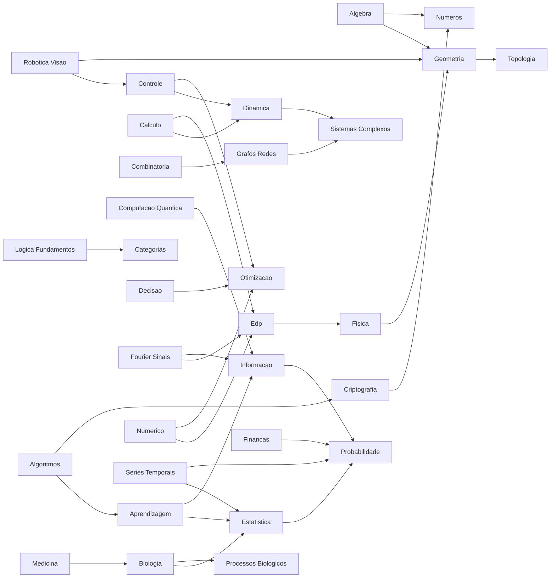

# Plano do Mapa de Conhecimento — Aulas 361 a 1000

> Estado vivo do conhecimento da PSF Calculadora. O mapa não cria ligações por aparência: cada aresta tem um tipo e uma justificativa reproduzível.

## Escopo e legenda

- Fonte analisada: `pasted-text.txt`.
- Aulas preservadas: **640**, sem lacunas, de 361 a 1000.
- Áreas: **64**.
- Motores examinados: **351**.
- Motores ligados ao material: **192**.
- Nós: **1087**; ligações documentadas: **2759**.
- `✅ TEMOS`: existe motor específico ou correspondência forte no código.
- `🟡 PARCIAL`: existe conhecimento vizinho, mas não implementação específica comprovada.
- `⬜ NÃO TEMOS`: nenhum motor foi ligado sem evidência.
- `pertence_a`, `prepara`, `expressa`, `implementado_por`, `relacionado_a` e `ponte_semantica` são os únicos tipos de ligação.

## Estado atual

- ✅ Temos: **138** aulas.
- 🟡 Parcial: **251** aulas.
- ⬜ Não temos: **251** aulas.

O status mede presença de capacidade no código, não profundidade pedagógica. Toda marcação `TEMOS` deve continuar acompanhada do nome do motor que serve como evidência.

## Como o conhecimento flui

A visualização completa está em `mapa_conhecimento_361_1000.json`. A navegação ocorre como numa teia: `aula → conceito → outra aula`, `aula → motor` e `aula → próxima aula`. Um hub pode receber centenas ou milhares de ligações; o gerador não impõe limite.

## Cobertura por área

| Área | ✅ Temos | 🟡 Parcial | ⬜ Não temos |
|---|---:|---:|---:|
| Análise Numérica de EDPs | 2 | 5 | 3 |
| Análise em Variedades e EDPs Geométricas | 3 | 7 | 0 |
| Combinatória Avançada | 6 | 3 | 1 |
| Encerramento da Nona Centena | 1 | 0 | 9 |
| Encerramento da Oitava Centena | 2 | 2 | 6 |
| Encerramento da Quinta Centena | 1 | 2 | 7 |
| Encerramento da Sexta Centena | 1 | 2 | 7 |
| Encerramento da Sétima Centena | 1 | 5 | 4 |
| Estatística Espacial e Geoestatística | 0 | 5 | 5 |
| Física Matemática | 4 | 3 | 3 |
| Física-Matemática Avançada | 0 | 7 | 3 |
| Geometria Algébrica Computacional | 4 | 5 | 1 |
| Geometria Computacional | 3 | 3 | 4 |
| Geometria Simplética e Poisson | 0 | 7 | 3 |
| Geometria da Informação | 3 | 5 | 2 |
| Geometria dos Números e Retículos | 2 | 4 | 4 |
| História, Filosofia e Curiosidades | 2 | 2 | 6 |
| Matemática Biológica | 10 | 0 | 0 |
| Matemática Financeira Quantitativa | 0 | 4 | 6 |
| Matemática da Astronomia e Cosmologia | 0 | 4 | 6 |
| Matemática da Computação Quântica | 2 | 5 | 3 |
| Matemática da Consciência e Cognição | 4 | 2 | 4 |
| Matemática da Energia e Sustentabilidade | 1 | 0 | 9 |
| Matemática da Genética e Evolução | 1 | 2 | 7 |
| Matemática da Medicina e Imagens Médicas | 1 | 4 | 5 |
| Matemática da Música e Acústica | 3 | 3 | 4 |
| Matemática da Percepção e Visão | 2 | 4 | 4 |
| Matemática da Robótica | 1 | 1 | 8 |
| Matemática das Decisões e Votação | 1 | 4 | 5 |
| Matemática das Redes Sociais | 1 | 8 | 1 |
| Matemática do Aprendizado Profundo (Deep Learning) | 1 | 3 | 6 |
| Matemática do Envelhecimento e Longevidade | 0 | 3 | 7 |
| Matemática do Universo Digital | 0 | 6 | 4 |
| Matemática dos Materiais e Engenharia | 2 | 2 | 6 |
| Matemática dos Riscos e Seguros (Atuária) | 1 | 3 | 6 |
| Matemática dos Sistemas Complexos | 1 | 4 | 5 |
| Matemática dos Sons e Imagens | 2 | 4 | 4 |
| Modelagem Matemática Multidisciplinar | 1 | 0 | 9 |
| O Grande Final | 1 | 4 | 5 |
| Programação Matemática e Otimização Discreta | 3 | 2 | 5 |
| Séries Temporais e Previsão | 1 | 4 | 5 |
| Teoria da Aprendizagem Estatística | 2 | 4 | 4 |
| Teoria da Complexidade Computacional | 1 | 8 | 1 |
| Teoria da Informação Quântica Avançada | 3 | 5 | 2 |
| Teoria da Informação e Aprendizado | 2 | 7 | 1 |
| Teoria da Prova e Fundamentos | 2 | 3 | 5 |
| Teoria das Probabilidades Avançada | 2 | 3 | 5 |
| Teoria de Controle e Sistemas Dinâmicos | 0 | 4 | 6 |
| Teoria de Ondas e Solitons | 3 | 5 | 2 |
| Teoria de Processos Estocásticos | 4 | 3 | 3 |
| Teoria de Representações | 0 | 8 | 2 |
| Teoria de Singularidades e Catástrofes | 2 | 4 | 4 |
| Teoria de Singularidades em EDPs | 3 | 2 | 5 |
| Teoria dos Conjuntos Avançada | 4 | 4 | 2 |
| Teoria dos Conjuntos Fuzzy e Lógica Difusa | 5 | 2 | 3 |
| Teoria dos Grafos Avançada | 4 | 4 | 2 |
| Teoria dos Jogos Avançada | 7 | 1 | 2 |
| Teoria dos Números Analítica | 6 | 3 | 1 |
| Teoria dos Números Computacional | 4 | 4 | 2 |
| Topologia Algébrica | 0 | 7 | 3 |
| Topologia de Dimensões Baixas | 4 | 5 | 1 |
| Tópicos de Geometria Enumerativa | 1 | 8 | 1 |
| Álgebra Homológica | 1 | 8 | 1 |
| Álgebra Universal e Teoria de Modelos | 3 | 6 | 1 |

## Aulas sem hub semântico adicional

Todas as aulas possuem ao menos as ligações estruturais `pertence_a` e `prepara`. As aulas abaixo ainda não receberam um hub conceitual além da própria área; elas foram documentadas, não ligadas artificialmente:

391, 392, 393, 394, 395, 396, 398, 399, 400, 401, 402, 403, 404, 410, 441, 443, 445, 446, 447, 450, 491, 493, 494, 497, 498, 499, 500, 511, 514, 515, 517, 518, 522, 525, 530, 591, 593, 595, 596, 598, 599, 600, 653, 654, 655, 657, 658, 659, 660, 692, 694, 696, 697, 699, 700, 772, 778, 779, 780, 781, 782, 783, 784, 786, 787, 788, 791, 792, 794, 796, 797, 798, 799, 800, 873, 875, 877, 879, 880, 881, 882, 883, 884, 886, 887, 888, 889, 890, 892, 893, 895, 896, 897, 898, 900, 961, 963, 964, 967, 968, 970, 981, 985, 986, 987, 989, 990, 991, 992, 994, 995, 996, 997, 998, 999, 1000

## Motores existentes sem ligação comprovada a estas aulas

Estes motores existem no projeto, mas o processo não encontrou evidência suficiente para ligá-los ao recorte 361–1000. Permanecem documentados e isolados, como solicitado:

`adicao_subtracao`, `agrupamentos`, `aneis_abstratos`, `aneis_polinomios`, `angulos`, `atratores_estranhos`, `autovalores_autovetores`, `banach_steinhaus`, `bezout`, `birkhoff`, `briot_ruffini`, `bsd_numerico`, `caminhos_circuitos`, `caos_deterministico`, `caos_lyapunov`, `categorias_aditivas_abelianas`, `codigo_hamming`, `combinacao`, `comparacao_riemann_lebesgue`, `congruencias_lineares_crt`, `conjuntos_numericos`, `continuidade`, `convergencia_dominada`, `convergencia_monotona`, `conversoes`, `coordenadas`, `curvatura_riemann`, `decimais`, `derivada_definicao`, `derivada_exterior`, `derivadas_parciais`, `determinantes`, `diagonalizacao`, `diagrama_venn`, `divisibilidade`, `ecc_aplicacoes`, `edo_introducao`, `edo_linear_primeira`, `edo_runge_kutta`, `edo_segunda_homogenea`, `edo_separavel`, `edp_introducao`, `equacoes_diofantinas_avancadas`, `espacos_banach`, `espacos_metricos`, `espacos_normados`, `espacos_recobrimento`, `espacos_topologicos`, `espacos_vetoriais`, `esperanca_variancia`, `expressoes`, `extremos_multivariaveis`, `fatores_primos`, `financeira_avancada`, `formas_diferenciais`, `fracoes`, `fracoes_continuas_avancadas`, `fractais`, `funcao_afim`, `funcao_logaritmica`, `funcao_quadratica`, `funcoes_varias_variaveis`, `geometrizacao`, `grafico_fechado`, `hahn_banach`, `heegaard`, `hiperbolizacao_thurston`, `hodge_computacional`, `ideais_quocientes`, `inequacao_primeiro_grau`, `inequacao_segundo_grau`, `inferencia_bayesiana_mcmc`, `integracao_complexa`, `intervalo_confianca`, `lei_cossenos`, `lei_senos`, `limites_avancados`, `limites_colimites`, `logaritmos`, `logica_proposicional`, `maquinas_turing`, `matematica_cotidiano`, `matematica_natureza`, `matrizes_especiais`, `mdc`, `media`, `medida_lebesgue`, `medida_produto_fubini`, `mmc`, `modelagem_matematica`, `multiplicacao_armada`, `multiplos`, `navier_stokes_diagnostico`, `normais_quocientes`, `numeros_algebricos_transcendentes`, `numeros_negativos`, `numeros_romanos`, `operacoes_vetoriais`, `operadores_pseudodiferenciais`, `operadores_vetoriais`, `pa`, `parada_indecidibilidade`, `paradoxos_logicos`, `paridade`, `pca_avancado`, `perimetro`, `permutacao`, `pg`, `plano_cartesiano`, `polinomio_alexander`, `polinomio_jones`, `polinomios`, `ponto_medio_baricentro`, `porcentagem`, `potenciacao`, `probabilidade`, `probabilidade_avancada_medida`, `probabilidade_condicional`, `probabilidade_total_bayes`, `produto_interno_avancado`, `produtos_coprodutos`, `produtos_vetoriais`, `pvsnp`, `quantificadores`, `raciocinio_logico`, `razao_proporcao`, `reciprocidade_quadratica`, `recorrencias`, `regra_cadeia`, `regra_tres`, `regra_tres_composta`, `residuos_quadraticos_legendre`, `semelhanca`, `simplex_tableau`, `sistema_binario`, `sistema_monetario`, `sistemas_dinamicos_discretos`, `stokes_generalizado`, `subgrupos_lagrange`, `subtracao_reserva`, `superficie`, `taylor_maclaurin`, `telecomunicacoes`, `tempo_frequencia`, `teorema_central_limite`, `teorema_divergencia`, `teoria_ergodica`, `teoria_filas`, `teoria_modelos`, `teste_hipoteses`, `totiente_euler`, `transporte_designacao`, `trigonometria_retangulo`, `turbo_ldpc`, `ultimo_teorema_fermat`, `vetores`, `volume_esfera`, `wavelets`, `yang_mills_lattice`

## Plano de evolução

- [x] Preservar as 640 aulas e as 64 áreas.
- [x] Ligar aulas a áreas, conceitos, sequência didática e motores comprovados.
- [x] Marcar `TEMOS`, `PARCIAL` e `NÃO TEMOS` com evidência.
- [x] Manter arquivo JSON consumível por visualizadores de grafos.
- [ ] Revisar manualmente os itens `PARCIAL`, começando pelas áreas com maior número de lacunas.
- [ ] Auditar cada item `TEMOS` com um teste funcional antes de considerá-lo cobertura pedagógica completa.
- [ ] Criar testes de competência para cada item promovido de `PARCIAL` para `TEMOS`.
- [ ] Migrar motores comprovados para módulos de domínio antes de retirar o monólito.
- [ ] Acrescentar novas aulas sem renumerar ou apagar relações históricas.

## Inventário completo

### 361–370 — Matemática Biológica

| Aula | Tema | Estado | Evidência no projeto | Hubs conceituais |
|---:|---|---|---|---|
| 361 | Modelos Populacionais (Malthus, Verhulst) | ✅ TEMOS | `modelos_populacionais_novo` | biologia |
| 362 | Modelos Presa-Predador (Lotka-Volterra) | ✅ TEMOS | `presa_predador_novo` | biologia, processos_biologicos |
| 363 | Modelos de Propagação de Doenças (SIR, SEIR) | ✅ TEMOS | `propagacao_doencas` | biologia, processos_biologicos |
| 364 | Equações de Reação-Difusão (padrões de Turing) | ✅ TEMOS | `reacao_difusao` | biologia, edp |
| 365 | Filogenética e Árvores Evolutivas | ✅ TEMOS | `filogenetica` | biologia, grafos_redes |
| 366 | Alinhamento de Sequências (Smith-Waterman) | ✅ TEMOS | `smith_waterman` | biologia |
| 367 | Bioinformática Estrutural (dobramento de proteínas) | ✅ TEMOS | `dobramento_proteinas` | biologia |
| 368 | Redes Reguladoras Gênicas (modelos booleanos) | ✅ TEMOS | `redes_genicas_booleanas` | biologia, grafos_redes |
| 369 | Neurociência Computacional (Hodgkin-Huxley) | ✅ TEMOS | `hodgkin_huxley` | algoritmos, biologia, processos_biologicos |
| 370 | Morfogênese e Sistemas de Lindenmayer (L-systems) | ✅ TEMOS | `l_systems` | biologia, processos_biologicos |
### 371–380 — Matemática Financeira Quantitativa

| Aula | Tema | Estado | Evidência no projeto | Hubs conceituais |
|---:|---|---|---|---|
| 371 | Opções Financeiras (call, put) | ⬜ NAO TEMOS | — | financas |
| 372 | Modelo de Black-Scholes (derivação e solução) | 🟡 PARCIAL | `regras_derivacao` | calculo, financas |
| 373 | Letras Gregas (Delta, Gamma, Theta, Vega) | 🟡 PARCIAL | `epsilon_delta` | financas |
| 374 | Movimento Browniano e Martingales | ⬜ NAO TEMOS | — | financas, probabilidade |
| 375 | Cálculo Estocástico (integral de Itô) | 🟡 PARCIAL | `integral_lebesgue`, `integral_indefinida`, `integral_definida` | calculo, financas, probabilidade |
| 376 | Medidas Martingale Equivalentes | ⬜ NAO TEMOS | — | financas |
| 377 | Modelos de Taxa de Juros (Vasicek, CIR) | 🟡 PARCIAL | `juros_simples`, `juros_compostos` | financas |
| 378 | Value at Risk (VaR) e Expected Shortfall | ⬜ NAO TEMOS | — | financas |
| 379 | Cópulas e Dependência Multivariada | ⬜ NAO TEMOS | — | financas |
| 380 | Finanças Comportamentais (modelos matemáticos de vieses) | ⬜ NAO TEMOS | — | etica, financas |
### 381–390 — Física Matemática

| Aula | Tema | Estado | Evidência no projeto | Hubs conceituais |
|---:|---|---|---|---|
| 381 | Mecânica Clássica (Lagrangiana, Hamiltoniana) | ⬜ NAO TEMOS | — | fisica |
| 382 | Equações de Hamilton e Espaço de Fase | ✅ TEMOS | `equacoes` | fisica |
| 383 | Mecânica Quântica (espaços de Hilbert, operadores) | ✅ TEMOS | `espacos_hilbert`, `espacos_lp` | fisica |
| 384 | Equação de Schrödinger | 🟡 PARCIAL | `equacao_reta`, `equacao_circunferencia`, `equacao_segundo_grau` | edp, fisica |
| 385 | Teoria Quântica de Campos (introdução matemática) | 🟡 PARCIAL | `informacao_quantica`, `computacao_quantica`, `campos_vetoriais_fluxos` | fisica |
| 386 | Relatividade Especial (espaço-tempo de Minkowski) | ✅ TEMOS | `tempo` | fisica |
| 387 | Relatividade Geral (equações de Einstein) | ✅ TEMOS | `relatividade_geral`, `equacoes` | fisica |
| 388 | Teoria de Cordas (introdução) | ⬜ NAO TEMOS | — | fisica |
| 389 | Simetrias e Leis de Conservação (Noether) | ⬜ NAO TEMOS | — | fisica |
| 390 | Grupos de Lie em Física (rotações, gauge) | 🟡 PARCIAL | `homomorfismos_grupos`, `grupos_abstratos` | algebra, fisica |
### 391–400 — História, Filosofia e Curiosidades

| Aula | Tema | Estado | Evidência no projeto | Hubs conceituais |
|---:|---|---|---|---|
| 391 | Matemática na Antiguidade (Egito, Mesopotâmia) | ⬜ NAO TEMOS | — | somente área/sequência |
| 392 | Matemática Grega (Tales, Pitágoras, Euclides) | ✅ TEMOS | `pitagoras` | somente área/sequência |
| 393 | Matemática Indiana e Chinesa | ⬜ NAO TEMOS | — | somente área/sequência |
| 394 | Matemática Islâmica Medieval (Al-Khwarizmi) | ⬜ NAO TEMOS | — | somente área/sequência |
| 395 | Revolução Científica (Galileu, Descartes, Newton) | 🟡 PARCIAL | `notacao_cientifica` | somente área/sequência |
| 396 | Matemática no Século XIX (Cauchy, Gauss, Riemann) | 🟡 PARCIAL | `superficies_riemann`, `riemann_roch`, `riemann_estado` | somente área/sequência |
| 397 | Crise dos Fundamentos (Russell, Hilbert, Gödel) | ✅ TEMOS | `godel` | logica_fundamentos |
| 398 | Bourbaki e a Matemática Moderna | ⬜ NAO TEMOS | — | somente área/sequência |
| 399 | Medalha Fields e Prêmio Abel (história e vencedores) | ⬜ NAO TEMOS | — | somente área/sequência |
| 400 | A Matemática como Linguagem do Universo | ⬜ NAO TEMOS | — | somente área/sequência |
### 401–410 — Teoria dos Jogos Avançada

| Aula | Tema | Estado | Evidência no projeto | Hubs conceituais |
|---:|---|---|---|---|
| 401 | Jogos Cooperativos (núcleo, valor de Shapley) | ✅ TEMOS | `teoria_jogos` | somente área/sequência |
| 402 | Jogos Não Cooperativos (equilíbrio de Nash refinado) | ✅ TEMOS | `teoria_jogos` | somente área/sequência |
| 403 | Jogos de Soma Zero e Teorema Minimax | ✅ TEMOS | `teoria_jogos` | somente área/sequência |
| 404 | Jogos Repetidos e Estratégias de Punição | ✅ TEMOS | `teoria_jogos` | somente área/sequência |
| 405 | Jogos Evolutivos (estratégias estáveis) | ✅ TEMOS | `teoria_jogos` | biologia |
| 406 | Jogos Bayesianos (informação incompleta) | ✅ TEMOS | `teoria_jogos` | informacao |
| 407 | Leilões e Desenho de Mecanismos (Vickrey, Myerson) | ⬜ NAO TEMOS | — | decisao |
| 408 | Escolha Social e Teorema da Impossibilidade de Arrow | 🟡 PARCIAL | `teorema_stokes`, `teorema_resto`, `teorema_green` | decisao |
| 409 | Jogos em Redes (grafos de interação) | ✅ TEMOS | `teoria_jogos`, `grafos` | grafos_redes |
| 410 | Aplicações em Economia e Ciência Política | ⬜ NAO TEMOS | — | somente área/sequência |
### 411–420 — Geometria Computacional

| Aula | Tema | Estado | Evidência no projeto | Hubs conceituais |
|---:|---|---|---|---|
| 411 | Fecho Convexo (algoritmos de Graham, Jarvis) | 🟡 PARCIAL | `algoritmos_ordenacao`, `algoritmos_numericos`, `algoritmos_geneticos` | algoritmos, geometria |
| 412 | Interseção de Segmentos e Linhas | ⬜ NAO TEMOS | — | algoritmos, geometria |
| 413 | Triangulação de Polígonos (Delaunay, Voronoi) | ⬜ NAO TEMOS | — | algoritmos, geometria |
| 414 | Diagramas de Voronoi e Aplicações | ⬜ NAO TEMOS | — | algoritmos, geometria |
| 415 | Localização de Pontos em Mapas Planares | 🟡 PARCIAL | `escalas_mapas`, `distancia_pontos`, `pontos_fixos_estabilidade` | algoritmos, geometria |
| 416 | Geometria de Distâncias (Problema de Procrustes) | 🟡 PARCIAL | `geometria_espacial` | algoritmos, geometria |
| 417 | Cascas Convexas e Aproximação Poligonal | ⬜ NAO TEMOS | — | algoritmos, geometria, numerico |
| 418 | Algoritmos para Polígonos (área, pertinência) | ✅ TEMOS | `area` | algoritmos, geometria |
| 419 | Geometria Computacional 3D (malhas, superfícies) | ✅ TEMOS | `superficies`, `matematica_computacional` | algoritmos, geometria |
| 420 | Aplicações em Robótica e Visão Computacional | ✅ TEMOS | `matematica_computacional` | algoritmos, geometria, robotica_visao |
### 421–430 — Teoria dos Grafos Avançada

| Aula | Tema | Estado | Evidência no projeto | Hubs conceituais |
|---:|---|---|---|---|
| 421 | Coloração de Grafos e Número Cromático | ✅ TEMOS | `grafos` | grafos_redes, numeros |
| 422 | Teorema das Quatro Cores (história e prova) | 🟡 PARCIAL | `teorema_stokes`, `teorema_resto`, `teorema_green` | grafos_redes, logica_fundamentos |
| 423 | Grafos Planares e Fórmula de Euler | ✅ TEMOS | `grafos` | grafos_redes |
| 424 | Emparelhamentos (matching) e Teorema de Hall | 🟡 PARCIAL | `teorema_stokes`, `teorema_resto`, `teorema_green` | grafos_redes |
| 425 | Grafos Hamiltonianos (condições de suficiência) | ✅ TEMOS | `grafos` | grafos_redes |
| 426 | Problema do Caixeiro Viajante (heurísticas) | ⬜ NAO TEMOS | — | grafos_redes, otimizacao |
| 427 | Fluxo Máximo e Corte Mínimo (algoritmos) | 🟡 PARCIAL | `fluxo_redes`, `algoritmos_ordenacao`, `algoritmos_numericos` | algoritmos, dinamica, grafos_redes |
| 428 | Random Graphs (modelo de Erdős–Rényi) | ⬜ NAO TEMOS | — | grafos_redes |
| 429 | Grafos Expanders e Aplicações | ✅ TEMOS | `grafos` | grafos_redes |
| 430 | Redes Complexas (small-world, scale-free, Barabási-Albert) | 🟡 PARCIAL | `redes_neurais`, `funcoes_complexas`, `fluxo_redes` | grafos_redes |
### 431–440 — Topologia Algébrica

| Aula | Tema | Estado | Evidência no projeto | Hubs conceituais |
|---:|---|---|---|---|
| 431 | Complexos Simpliciais e Homologia Simplicial | 🟡 PARCIAL | `numeros_complexos`, `homologia_khovanov`, `complexos_polar_euler` | sistemas_complexos, topologia |
| 432 | Homologia Singular | 🟡 PARCIAL | `homologia_khovanov` | topologia |
| 433 | Sequências Exatas e Aplicações | 🟡 PARCIAL | `sequencias_series_numericas` | topologia |
| 434 | Cohomologia e Anel de Cohomologia | 🟡 PARCIAL | `cohomologia_feixes`, `anel_coordenadas_zariski` | algebra, topologia |
| 435 | Dualidade de Poincaré | 🟡 PARCIAL | `poincare_computacional` | topologia |
| 436 | Grupos de Homotopia Superiores | 🟡 PARCIAL | `homomorfismos_grupos`, `grupos_abstratos`, `homotopia_grupo_fundamental` | algebra, topologia |
| 437 | Fibrados e Fibrações (sequência exata longa) | ⬜ NAO TEMOS | — | topologia |
| 438 | Teoria da Obstrução | ⬜ NAO TEMOS | — | topologia |
| 439 | Classes Características (Chern, Stiefel-Whitney) | ⬜ NAO TEMOS | — | topologia |
| 440 | K-Teoria Topológica (introdução) | 🟡 PARCIAL | `continuidade_topologica`, `conexidade_topologica` | topologia |
### 441–450 — Matemática dos Sons e Imagens

| Aula | Tema | Estado | Evidência no projeto | Hubs conceituais |
|---:|---|---|---|---|
| 441 | Digitalização de Sinais (amostragem, Nyquist-Shannon) | 🟡 PARCIAL | `processamento_sinais`, `entropia_shannon` | somente área/sequência |
| 442 | Quantização e Codificação de Áudio (PCM, MP3) | ⬜ NAO TEMOS | — | fourier_sinais, informacao |
| 443 | Filtros Digitais (FIR, IIR) | ⬜ NAO TEMOS | — | somente área/sequência |
| 444 | Transformada Discreta de Fourier (DFT, FFT) | ✅ TEMOS | `transformada_fourier_rn`, `transformada_fourier_r` | fourier_sinais |
| 445 | Filtragem de Imagens (convolução, kernel) | 🟡 PARCIAL | `compressao_imagens_wavelet` | somente área/sequência |
| 446 | Detecção de Bordas (Sobel, Canny) | ⬜ NAO TEMOS | — | somente área/sequência |
| 447 | Restauração de Imagens (Wiener, Richardson-Lucy) | 🟡 PARCIAL | `compressao_imagens_wavelet` | somente área/sequência |
| 448 | Compressão de Vídeo (MPEG, padrões) | 🟡 PARCIAL | `compressao_perdas`, `compressao_imagens_wavelet` | informacao |
| 449 | Reconhecimento de Padrões (template matching) | ⬜ NAO TEMOS | — | grafos_redes |
| 450 | Síntese de Som e Modelagem Acústica | ✅ TEMOS | `sintese_matematica` | somente área/sequência |
### 451–460 — Estatística Espacial e Geoestatística

| Aula | Tema | Estado | Evidência no projeto | Hubs conceituais |
|---:|---|---|---|---|
| 451 | Processos Espaciais Pontuais (Poisson, cluster) | ⬜ NAO TEMOS | — | estatistica, probabilidade |
| 452 | Autocorrelação Espacial (I de Moran, C de Geary) | 🟡 PARCIAL | `geometria_espacial` | estatistica |
| 453 | Variograma e Semivariograma | ⬜ NAO TEMOS | — | estatistica |
| 454 | Krigagem (predição espacial) | 🟡 PARCIAL | `geometria_espacial` | estatistica |
| 455 | Modelos Areais (CAR, SAR) | ⬜ NAO TEMOS | — | estatistica |
| 456 | Estatística em Sensoriamento Remoto | 🟡 PARCIAL | `estatistica_central`, `estatistica_causal` | estatistica |
| 457 | Mapas de Risco e Modelagem de Desastres | 🟡 PARCIAL | `escalas_mapas` | estatistica, financas |
| 458 | Análise de Dados de GPS e Trajetórias | 🟡 PARCIAL | `estruturas_dados`, `analise_discriminante`, `analise_funcional_quantum` | estatistica, robotica_visao |
| 459 | Geoestatística Multivariada (cokrigagem) | ⬜ NAO TEMOS | — | estatistica |
| 460 | Aplicações em Meio Ambiente e Geologia | ⬜ NAO TEMOS | — | estatistica |
### 461–470 — Álgebra Universal e Teoria de Modelos

| Aula | Tema | Estado | Evidência no projeto | Hubs conceituais |
|---:|---|---|---|---|
| 461 | Estruturas Algébricas Universais (variedades) | 🟡 PARCIAL | `variedades_diferenciaveis`, `integracao_variedades`, `estruturas_dados` | algebra, geometria |
| 462 | Álgebras de Boole e Retículos | 🟡 PARCIAL | `sigma_algebras` | algebra |
| 463 | Operadores de Fecho e Galois | ✅ TEMOS | `galois_introducao` | algebra |
| 464 | Teoria de Modelos: Estruturas e Linguagens | 🟡 PARCIAL | `estruturas_dados` | algebra |
| 465 | Teorema da Compacidade em Lógica | ✅ TEMOS | `logica_matematica`, `compacidade` | algebra, logica_fundamentos |
| 466 | Teoremas de Löwenheim-Skolem | 🟡 PARCIAL | `teoremas_euler_fermat` | algebra |
| 467 | Tipos e Espaços de Tipos | ✅ TEMOS | `espacos_lp` | algebra, logica_fundamentos |
| 468 | Modelos Saturados e Homogêneos | ⬜ NAO TEMOS | — | algebra |
| 469 | Teoria da Estabilidade (Shelah) | 🟡 PARCIAL | `pontos_fixos_estabilidade` | algebra, dinamica |
| 470 | Aplicações em Álgebra e Geometria | 🟡 PARCIAL | `geometria_espacial`, `aplicacoes_algebra_linear`, `aplicacoes_algebra_abstrata` | algebra, geometria |
### 471–480 — Teoria dos Conjuntos Avançada

| Aula | Tema | Estado | Evidência no projeto | Hubs conceituais |
|---:|---|---|---|---|
| 471 | Ordinais e Indução Transfinita | ✅ TEMOS | `inducao_matematica` | logica_fundamentos |
| 472 | Cardinais e Aritmética Cardinal | ⬜ NAO TEMOS | — | logica_fundamentos, numeros |
| 473 | Hipótese do Contínuo (CH) e Independência | 🟡 PARCIAL | `hipotese_riemann` | logica_fundamentos |
| 474 | Forcing (Cohen) e Extensões Genéricas | 🟡 PARCIAL | `corpos_extensoes` | logica_fundamentos |
| 475 | Grandes Cardinais (inacessíveis, mensuráveis) | 🟡 PARCIAL | `funcoes_mensuraveis` | logica_fundamentos |
| 476 | Determinância e Jogos Infinitos | ✅ TEMOS | `teoria_jogos` | logica_fundamentos |
| 477 | Axiomas de Martin e Forcing Iterado | 🟡 PARCIAL | `axiomas_separacao`, `axiomas_peano` | logica_fundamentos |
| 478 | Conjuntos de Números Reais (Borel, projetivos) | ✅ TEMOS | `teoria_numeros_avancada`, `teoria_conjuntos` | logica_fundamentos, numeros |
| 479 | Teoria Descritiva dos Conjuntos | ✅ TEMOS | `teoria_conjuntos` | logica_fundamentos |
| 480 | Consequências Filosóficas da Independência | ⬜ NAO TEMOS | — | logica_fundamentos |
### 481–490 — Matemática da Computação Quântica

| Aula | Tema | Estado | Evidência no projeto | Hubs conceituais |
|---:|---|---|---|---|
| 481 | Álgebra Linear para Computação Quântica | ✅ TEMOS | `computacao_quantica`, `aplicacoes_algebra_linear` | algebra, computacao_quantica, fisica |
| 482 | Qubits e Portas Lógicas Quânticas | ⬜ NAO TEMOS | — | computacao_quantica, fisica, logica_fundamentos |
| 483 | Emaranhamento e Desigualdades de Bell | ⬜ NAO TEMOS | — | computacao_quantica, fisica |
| 484 | Algoritmo de Shor (fatoração quântica) | 🟡 PARCIAL | `informacao_quantica`, `computacao_quantica` | algoritmos, computacao_quantica, fisica, numeros |
| 485 | Algoritmo de Grover (busca quântica) | 🟡 PARCIAL | `informacao_quantica`, `computacao_quantica`, `arvores_busca` | algoritmos, computacao_quantica, fisica |
| 486 | Correção de Erros Quânticos | ⬜ NAO TEMOS | — | computacao_quantica, fisica, numerico |
| 487 | Criptografia Quântica (BB84, distribuição de chaves) | 🟡 PARCIAL | `informacao_quantica`, `distribuicao_normal`, `distribuicao_binomial` | computacao_quantica, criptografia, fisica |
| 488 | Complexidade Quântica (BQP, QMA) | 🟡 PARCIAL | `informacao_quantica`, `computacao_quantica`, `algoritmos_complexidade` | algoritmos, computacao_quantica, fisica |
| 489 | Simulação Quântica de Sistemas Físicos | 🟡 PARCIAL | `sistemas_lineares`, `sistemas_edo`, `sistemas_dedutivos` | computacao_quantica, fisica |
| 490 | O Futuro da Computação (supremacia quântica) | ✅ TEMOS | `computacao_quantica` | computacao_quantica, fisica |
### 491–500 — Encerramento da Quinta Centena

| Aula | Tema | Estado | Evidência no projeto | Hubs conceituais |
|---:|---|---|---|---|
| 491 | Matemática do Clima e Mudanças Climáticas | ⬜ NAO TEMOS | — | somente área/sequência |
| 492 | Modelagem de Epidemias em Grande Escala | ⬜ NAO TEMOS | — | medicina |
| 493 | Matemática do Tráfego e Mobilidade Urbana | ⬜ NAO TEMOS | — | somente área/sequência |
| 494 | Matemática da Música (séries harmônicas, temperamentos) | ✅ TEMOS | `matematica_musica` | somente área/sequência |
| 495 | Matemática do Esporte (estatísticas, táticas) | ⬜ NAO TEMOS | — | estatistica |
| 496 | Matemática Forense (análise de dados em investigações) | 🟡 PARCIAL | `estruturas_dados`, `analise_discriminante`, `analise_funcional_quantum` | estatistica |
| 497 | O Ensino da Matemática no Século XXI | ⬜ NAO TEMOS | — | somente área/sequência |
| 498 | Divulgação Matemática (como explicar para o público) | ⬜ NAO TEMOS | — | somente área/sequência |
| 499 | O Infinito Potencial da Matemática | 🟡 PARCIAL | `infinito_cantor` | somente área/sequência |
| 500 | Marco 500: Meio Milhar de Aulas — Um Mapa do Conhecimento Matemático | ⬜ NAO TEMOS | — | somente área/sequência |
### 501–510 — Teoria da Prova e Fundamentos

| Aula | Tema | Estado | Evidência no projeto | Hubs conceituais |
|---:|---|---|---|---|
| 501 | Dedução Natural e Cálculo de Sequentes | ⬜ NAO TEMOS | — | calculo, logica_fundamentos |
| 502 | Normalização e Eliminação de Corte (Gentzen) | ⬜ NAO TEMOS | — | logica_fundamentos |
| 503 | Teoria dos Tipos e Cálculo Lambda | ⬜ NAO TEMOS | — | calculo, logica_fundamentos |
| 504 | Correspondência de Curry-Howard (provas como programas) | 🟡 PARCIAL | `provas_automaticas` | logica_fundamentos |
| 505 | Assistente de Provas (Coq, Lean, Agda) | 🟡 PARCIAL | `provas_automaticas` | logica_fundamentos |
| 506 | Teoria da Prova Estrutural | ⬜ NAO TEMOS | — | logica_fundamentos |
| 507 | Provas Automáticas e SMT Solvers | ✅ TEMOS | `provas_automaticas` | logica_fundamentos |
| 508 | Lógica Linear (recursos, fragmentos) | ✅ TEMOS | `logica_matematica` | logica_fundamentos |
| 509 | Lógicas Modais (necessidade, possibilidade, Kripke) | ⬜ NAO TEMOS | — | logica_fundamentos |
| 510 | Lógicas Não Clássicas (paraconsistente, fuzzy) | 🟡 PARCIAL | `otimizacao_nao_linear`, `equacoes_nao_lineares_numericas`, `edo_segunda_nao_homogenea` | logica_fundamentos |
### 511–520 — Matemática dos Materiais e Engenharia

| Aula | Tema | Estado | Evidência no projeto | Hubs conceituais |
|---:|---|---|---|---|
| 511 | Equações Constitutivas de Materiais (elasticidade) | ✅ TEMOS | `equacoes` | somente área/sequência |
| 512 | Mecânica dos Sólidos (tensores de tensão e deformação) | ⬜ NAO TEMOS | — | fisica |
| 513 | Mecânica dos Fluidos (Navier-Stokes computacional) | ✅ TEMOS | `matematica_computacional` | algoritmos, edp, fisica |
| 514 | Homogeneização e Materiais Compósitos | ⬜ NAO TEMOS | — | somente área/sequência |
| 515 | Modelagem de Fraturas e Fadiga | ⬜ NAO TEMOS | — | somente área/sequência |
| 516 | Cristalografia Matemática (grupos espaciais) | 🟡 PARCIAL | `homomorfismos_grupos`, `grupos_abstratos` | algebra |
| 517 | Quasicristais e Pavimentações de Penrose | ⬜ NAO TEMOS | — | somente área/sequência |
| 518 | Metamateriais e Óptica de Transformação | ⬜ NAO TEMOS | — | somente área/sequência |
| 519 | Teoria do Controle (controlabilidade, observabilidade) | ⬜ NAO TEMOS | — | controle |
| 520 | Controle Ótimo e Princípio do Máximo de Pontryagin | 🟡 PARCIAL | `principio_contagem` | controle |
### 521–530 — Teoria de Representações

| Aula | Tema | Estado | Evidência no projeto | Hubs conceituais |
|---:|---|---|---|---|
| 521 | Representações de Grupos Finitos (Mashke, caracteres) | 🟡 PARCIAL | `homomorfismos_grupos`, `grupos_abstratos`, `elementos_finitos` | algebra |
| 522 | Tabela de Caracteres e Ortogonalidade | 🟡 PARCIAL | `tabela_trigonometrica`, `ortogonalidade_projecao` | somente área/sequência |
| 523 | Representações de Grupos de Lie Compactos | 🟡 PARCIAL | `homomorfismos_grupos`, `grupos_abstratos` | algebra |
| 524 | Álgebras de Lie e Suas Representações | 🟡 PARCIAL | `sigma_algebras` | algebra |
| 525 | Pesos, Raízes e Diagramas de Dynkin | 🟡 PARCIAL | `raizes_primitivas_log_discreto` | somente área/sequência |
| 526 | Representações de Álgebras Associativas | 🟡 PARCIAL | `sigma_algebras` | algebra |
| 527 | Teoria de Representações e Física (simetrias) | ⬜ NAO TEMOS | — | fisica |
| 528 | Quivers e Álgebras de Caminho | 🟡 PARCIAL | `sigma_algebras` | algebra, grafos_redes |
| 529 | Representações Modulares (corpos de característica p) | 🟡 PARCIAL | `corpos_extensoes` | algebra |
| 530 | Programa de Langlands (introdução visionária) | ⬜ NAO TEMOS | — | somente área/sequência |
### 531–540 — Geometria Simplética e Poisson

| Aula | Tema | Estado | Evidência no projeto | Hubs conceituais |
|---:|---|---|---|---|
| 531 | Variedades Simpléticas (definição, exemplos) | 🟡 PARCIAL | `variedades_diferenciaveis`, `integracao_variedades`, `variedades_afins_projetivas` | geometria, probabilidade |
| 532 | Teorema de Darboux | 🟡 PARCIAL | `teorema_stokes`, `teorema_resto`, `teorema_green` | geometria, probabilidade |
| 533 | Aplicações Momento e Redução Simplética | ⬜ NAO TEMOS | — | geometria, probabilidade |
| 534 | Geometria de Poisson e Folheações | 🟡 PARCIAL | `geometria_espacial` | geometria, probabilidade |
| 535 | Grupoides Simpléticos | ⬜ NAO TEMOS | — | algebra, geometria, probabilidade |
| 536 | Topologia Simplética (invariantes de Gromov) | 🟡 PARCIAL | `metrica_topologia`, `invariantes_nos` | geometria, probabilidade, topologia |
| 537 | Curvas Pseudoholomorfas | 🟡 PARCIAL | `curvas_parametrizadas`, `curvas_algebricas_planas`, `criptografia_curvas_elipticas` | geometria, probabilidade |
| 538 | Homologia de Floer | 🟡 PARCIAL | `homologia_khovanov` | geometria, probabilidade, topologia |
| 539 | Espelhos e Simetria de Mirror (introdução) | ⬜ NAO TEMOS | — | geometria, probabilidade |
| 540 | Aplicações em Mecânica Clássica e Quântica | 🟡 PARCIAL | `informacao_quantica`, `computacao_quantica` | fisica, geometria, probabilidade |
### 541–550 — Análise em Variedades e EDPs Geométricas

| Aula | Tema | Estado | Evidência no projeto | Hubs conceituais |
|---:|---|---|---|---|
| 541 | Operador de Laplace-Beltrami | 🟡 PARCIAL | `transformada_laplace` | edp, geometria |
| 542 | Problema de Dirichlet em Variedades | 🟡 PARCIAL | `variedades_diferenciaveis`, `integracao_variedades`, `variedades_afins_projetivas` | edp, geometria |
| 543 | Geodésicas e o Fluxo Geodésico | 🟡 PARCIAL | `geodesicas_riemannianas`, `fluxo_redes` | dinamica, edp, geometria |
| 544 | Curvatura Escalar e Teorema da Massa Positiva | ✅ TEMOS | `curvatura` | edp, geometria |
| 545 | Fluxo de Ricci (Hamilton, Perelman) | 🟡 PARCIAL | `fluxo_redes` | dinamica, edp, geometria |
| 546 | EDPs Elípticas em Domínios com Fronteira | 🟡 PARCIAL | `criptografia_curvas_elipticas`, `curvas_elipticas_lei_grupo` | edp, geometria |
| 547 | EDPs Parabólicas e Difusão em Variedades | 🟡 PARCIAL | `variedades_diferenciaveis`, `reacao_difusao`, `integracao_variedades` | edp, geometria |
| 548 | Estimativas de Sobolev e Imersões | 🟡 PARCIAL | `espacos_sobolev_novo` | edp, geometria |
| 549 | Problemas Variacionais e Concentração de Compacidade | ✅ TEMOS | `compacidade` | edp, geometria |
| 550 | Superfícies Mínimas e Problema de Plateau | ✅ TEMOS | `superficies` | edp, geometria |
### 551–560 — Combinatória Avançada

| Aula | Tema | Estado | Evidência no projeto | Hubs conceituais |
|---:|---|---|---|---|
| 551 | Teoria de Ramsey (ordem na desordem) | 🟡 PARCIAL | `logica_primeira_ordem` | combinatoria |
| 552 | Números de Ramsey e Limitantes | ✅ TEMOS | `teoria_numeros_avancada` | combinatoria, numeros |
| 553 | Combinatória Extremal (teorema de Turán) | ✅ TEMOS | `combinatoria_avancada` | combinatoria |
| 554 | Método Probabilístico em Combinatória (Erdős) | ✅ TEMOS | `combinatoria_avancada` | combinatoria, probabilidade |
| 555 | Designs Combinatórios (BIBD, Steiner) | ⬜ NAO TEMOS | — | combinatoria |
| 556 | Quadrados Latinos e Ortogonalidade | 🟡 PARCIAL | `ortogonalidade_projecao` | combinatoria |
| 557 | Matrizes de Hadamard | ✅ TEMOS | `matrizes` | combinatoria |
| 558 | Funções Geradoras em Combinatória | ✅ TEMOS | `funcoes`, `combinatoria_avancada` | combinatoria |
| 559 | Partições de Inteiros e Teorema de Hardy-Ramanujan | 🟡 PARCIAL | `teorema_stokes`, `teorema_resto`, `teorema_green` | combinatoria |
| 560 | Combinatória Aditiva (somas, progressões, Szemerédi) | ✅ TEMOS | `combinatoria_avancada` | combinatoria |
### 561–570 — Teoria da Aprendizagem Estatística

| Aula | Tema | Estado | Evidência no projeto | Hubs conceituais |
|---:|---|---|---|---|
| 561 | Aprendizado Supervisionado e Não Supervisionado | 🟡 PARCIAL | `otimizacao_nao_linear`, `equacoes_nao_lineares_numericas`, `edo_segunda_nao_homogenea` | aprendizagem, estatistica |
| 562 | Dimensão VC e Teoria da Generalização | ⬜ NAO TEMOS | — | aprendizagem, estatistica |
| 563 | Regularização (Lasso, Ridge, Elastic Net) | ⬜ NAO TEMOS | — | aprendizagem, estatistica |
| 564 | Kernel Methods (SVM, RKHS, kernel trick) | ✅ TEMOS | `svm` | aprendizagem, estatistica |
| 565 | Processos Gaussianos para Regressão | 🟡 PARCIAL | `regressao_logistica`, `correlacao_regressao` | aprendizagem, estatistica |
| 566 | Gradient Boosting (XGBoost, LightGBM) | ⬜ NAO TEMOS | — | aprendizagem, estatistica |
| 567 | Redes Neurais Convolucionais (CNN) | ✅ TEMOS | `redes_neurais` | aprendizagem, estatistica, grafos_redes |
| 568 | Redes Recorrentes e Atenção (LSTM, Transformer) | 🟡 PARCIAL | `redes_neurais`, `fluxo_redes`, `redes_genicas_booleanas` | aprendizagem, estatistica, grafos_redes |
| 569 | Modelos Generativos (GAN, VAE, difusão) | 🟡 PARCIAL | `reacao_difusao` | aprendizagem, edp, estatistica |
| 570 | Aprendizado por Reforço (Q-Learning, Policy Gradient) | ⬜ NAO TEMOS | — | aprendizagem, estatistica |
### 571–580 — Teoria dos Números Computacional

| Aula | Tema | Estado | Evidência no projeto | Hubs conceituais |
|---:|---|---|---|---|
| 571 | Testes de Primalidade (Miller-Rabin, AKS) | ⬜ NAO TEMOS | — | algoritmos, numeros |
| 572 | Algoritmos de Fatoração (Pollard Rho, Crivo Quadrático) | 🟡 PARCIAL | `algoritmos_ordenacao`, `algoritmos_numericos`, `algoritmos_geneticos` | algoritmos, numeros |
| 573 | Crivo de Corpo de Números (Number Field Sieve) | ✅ TEMOS | `teoria_numeros_avancada` | algebra, algoritmos, numeros |
| 574 | Criptografia RSA (implementação e ataques) | ✅ TEMOS | `criptografia_rsa` | algoritmos, criptografia, numeros |
| 575 | Curvas Elípticas em Criptografia (ECDH, ECDSA) | ✅ TEMOS | `criptografia_curvas_elipticas`, `curvas_elipticas_lei_grupo` | algoritmos, criptografia, numeros |
| 576 | Logaritmo Discreto e Protocolos | 🟡 PARCIAL | `raizes_primitivas_log_discreto` | algoritmos, numeros |
| 577 | Provas de Conhecimento Zero | 🟡 PARCIAL | `provas_automaticas` | algoritmos, criptografia, logica_fundamentos, numeros |
| 578 | Assinaturas Digitais e Funções Hash | ✅ TEMOS | `funcoes` | algoritmos, criptografia, numeros |
| 579 | Criptografia Pós-Quântica (lattice-based, code-based) | 🟡 PARCIAL | `informacao_quantica`, `criptografia_rsa`, `computacao_quantica` | algoritmos, criptografia, fisica, numeros |
| 580 | Blockchain e Consenso Distribuído (matemática subjacente) | ⬜ NAO TEMOS | — | algoritmos, numeros |
### 581–590 — Física-Matemática Avançada

| Aula | Tema | Estado | Evidência no projeto | Hubs conceituais |
|---:|---|---|---|---|
| 581 | Axiomas de Wightman e Teoria Quântica de Campos | 🟡 PARCIAL | `informacao_quantica`, `computacao_quantica`, `axiomas_separacao` | fisica, logica_fundamentos |
| 582 | Integrais de Trajetória (Feynman) | 🟡 PARCIAL | `integrais_superficie`, `integrais_linha` | fisica, robotica_visao |
| 583 | Renormalização e Grupo de Renormalização | 🟡 PARCIAL | `homotopia_grupo_fundamental`, `curvas_elipticas_lei_grupo` | algebra, fisica |
| 584 | Teorias de Gauge e Geometria | 🟡 PARCIAL | `geometria_espacial` | fisica, geometria |
| 585 | Monopolos Magnéticos e Instantons | ⬜ NAO TEMOS | — | fisica |
| 586 | Supersimetria e Supergeometria | ⬜ NAO TEMOS | — | fisica |
| 587 | Dualidade e Cordas (AdS/CFT) | ⬜ NAO TEMOS | — | fisica |
| 588 | Teoria de Campos Conformes (CFT) | 🟡 PARCIAL | `campos_vetoriais_fluxos` | fisica |
| 589 | Álgebras de Vértices e Monstrous Moonshine | 🟡 PARCIAL | `sigma_algebras` | algebra, fisica |
| 590 | Entropia de Buracos Negros e Informação | 🟡 PARCIAL | `informacao_quantica`, `informacao_mutua_kl`, `entropia_shannon` | fisica, informacao |
### 591–600 — Encerramento da Sexta Centena

| Aula | Tema | Estado | Evidência no projeto | Hubs conceituais |
|---:|---|---|---|---|
| 591 | Filosofia da Matemática Aplicada (modelos e realidade) | ⬜ NAO TEMOS | — | somente área/sequência |
| 592 | Matemática e Ética (algoritmos, vieses, justiça) | 🟡 PARCIAL | `algoritmos_ordenacao`, `algoritmos_numericos`, `algoritmos_geneticos` | algoritmos, etica |
| 593 | O Papel da Beleza nas Descobertas Matemáticas | ✅ TEMOS | `beleza_matematica` | somente área/sequência |
| 594 | Erros Famosos e Como Avançaram a Matemática | ⬜ NAO TEMOS | — | numerico |
| 595 | A Colaboração Matemática Global (Polymath, MathOverflow) | ⬜ NAO TEMOS | — | somente área/sequência |
| 596 | O Cérebro Matemático (neurociência da matemática) | ⬜ NAO TEMOS | — | somente área/sequência |
| 597 | Matemática e Criatividade (heurísticas, insight) | ⬜ NAO TEMOS | — | otimizacao |
| 598 | Matemática na Literatura e Cinema | ⬜ NAO TEMOS | — | somente área/sequência |
| 599 | Preparação para o Infinito: Como Seguir Estudando | 🟡 PARCIAL | `infinito_cantor` | somente área/sequência |
| 600 | Marco 600: A Jornada do Aprendiz ao Mestre | ⬜ NAO TEMOS | — | somente área/sequência |
### 601–610 — Matemática dos Riscos e Seguros (Atuária)

| Aula | Tema | Estado | Evidência no projeto | Hubs conceituais |
|---:|---|---|---|---|
| 601 | Tábuas de Mortalidade e Expectativa de Vida | ⬜ NAO TEMOS | — | financas, medicina |
| 602 | Prêmios de Seguro (cálculo e princípios) | ⬜ NAO TEMOS | — | calculo, financas |
| 603 | Reservas Matemáticas (provisões técnicas) | 🟡 PARCIAL | `demonstracoes_matematicas` | financas |
| 604 | Modelos de Ruína (Cramér-Lundberg) | ⬜ NAO TEMOS | — | financas |
| 605 | Teoria da Credibilidade | ⬜ NAO TEMOS | — | financas |
| 606 | Seguro de Vida e Previdência (matemática atuarial) | ⬜ NAO TEMOS | — | financas |
| 607 | Risco Operacional e Modelagem de Perdas | 🟡 PARCIAL | `compressao_perdas` | financas |
| 608 | Catástrofes e Modelagem de Eventos Extremos | ✅ TEMOS | `extremos` | financas |
| 609 | Solvência e Requerimentos de Capital (Solvência II) | ⬜ NAO TEMOS | — | financas |
| 610 | Matemática Atuarial e Grandes Dados | 🟡 PARCIAL | `estruturas_dados` | estatistica, financas |
### 611–620 — Matemática da Genética e Evolução

| Aula | Tema | Estado | Evidência no projeto | Hubs conceituais |
|---:|---|---|---|---|
| 611 | Genética de Populações (Hardy-Weinberg) | ⬜ NAO TEMOS | — | biologia |
| 612 | Deriva Genética e Modelos de Wright-Fisher | ⬜ NAO TEMOS | — | biologia, calculo |
| 613 | Coalescência e Ancestralidade | ⬜ NAO TEMOS | — | biologia |
| 614 | Modelos de Substituição de Nucleotídeos (Jukes-Cantor) | 🟡 PARCIAL | `infinito_cantor` | biologia |
| 615 | Árvores Filogenéticas (máxima verossimilhança) | ✅ TEMOS | `filogenetica` | biologia, grafos_redes |
| 616 | Relógio Molecular e Datação de Divergências | ⬜ NAO TEMOS | — | biologia |
| 617 | GWAS e Associação Genômica (modelos lineares mistos) | 🟡 PARCIAL | `transformacoes_lineares`, `sistemas_lineares`, `operadores_lineares_limitados` | biologia |
| 618 | Equilíbrio de Ligação e Haplótipos | ⬜ NAO TEMOS | — | biologia |
| 619 | Genética Quantitativa (herdabilidade, BLUP) | ⬜ NAO TEMOS | — | biologia |
| 620 | Evolução Molecular e Seleção Natural (modelos matemáticos) | ⬜ NAO TEMOS | — | biologia |
### 621–630 — Teoria da Complexidade Computacional

| Aula | Tema | Estado | Evidência no projeto | Hubs conceituais |
|---:|---|---|---|---|
| 621 | Classes P, NP, co-NP (definições formais) | ⬜ NAO TEMOS | — | algoritmos |
| 622 | Reduções Polinomiais e NP-Completude | 🟡 PARCIAL | `completude_reais` | algebra, algoritmos |
| 623 | Teorema de Cook-Levin (SAT é NP-completo) | 🟡 PARCIAL | `teorema_stokes`, `teorema_resto`, `teorema_green` | algoritmos |
| 624 | Hierarquia Polinomial (PH) | 🟡 PARCIAL | `interpolacao_polinomial` | algebra, algoritmos |
| 625 | Complexidade de Espaço (L, NL, PSPACE) | 🟡 PARCIAL | `algoritmos_complexidade`, `espaco_fibrado_tangente` | algoritmos |
| 626 | Complexidade Probabilística (BPP, RP, ZPP) | 🟡 PARCIAL | `algoritmos_complexidade` | algoritmos, probabilidade |
| 627 | Complexidade Quântica (BQP, QMA) | 🟡 PARCIAL | `informacao_quantica`, `computacao_quantica`, `algoritmos_complexidade` | algoritmos, fisica |
| 628 | Contagem e Complexidade (#P, teorema de Valiant) | 🟡 PARCIAL | `teorema_stokes`, `teorema_resto`, `teorema_green` | algoritmos, combinatoria |
| 629 | Complexidade Parametrizada (FPT, W-hierarquia) | 🟡 PARCIAL | `algoritmos_complexidade` | algoritmos |
| 630 | Limites Inferiores e Barreiras (provas naturais) | ✅ TEMOS | `limites` | algoritmos, logica_fundamentos |
### 631–640 — Matemática das Decisões e Votação

| Aula | Tema | Estado | Evidência no projeto | Hubs conceituais |
|---:|---|---|---|---|
| 631 | Sistemas de Votação (pluralidade, Borda, Condorcet) | 🟡 PARCIAL | `sistemas_lineares`, `sistemas_edo`, `sistemas_dedutivos` | decisao |
| 632 | Teorema da Impossibilidade de Arrow (detalhado) | 🟡 PARCIAL | `teorema_stokes`, `teorema_resto`, `teorema_green` | decisao |
| 633 | Teorema de Gibbard-Satterthwaite | 🟡 PARCIAL | `teorema_stokes`, `teorema_resto`, `teorema_green` | decisao |
| 634 | Desenho de Mecanismos e Implementação | ⬜ NAO TEMOS | — | decisao |
| 635 | Alocação Justa (divisão de bolo, envy-free) | ✅ TEMOS | `divisao` | decisao |
| 636 | Matching e Escolha de Escolas (Gale-Shapley) | 🟡 PARCIAL | `axioma_escolha` | decisao, grafos_redes |
| 637 | Índices de Poder (Shapley-Shubik, Banzhaf) | ⬜ NAO TEMOS | — | decisao |
| 638 | Redistritamento e Gerrymandering (métricas) | ⬜ NAO TEMOS | — | decisao, geometria |
| 639 | Democracia Líquida e Votação Delegativa | ⬜ NAO TEMOS | — | decisao |
| 640 | Blockchain e Governança Descentralizada (matemática) | ⬜ NAO TEMOS | — | decisao |
### 641–650 — Geometria da Informação

| Aula | Tema | Estado | Evidência no projeto | Hubs conceituais |
|---:|---|---|---|---|
| 641 | Variedades Estatísticas e Métrica de Fisher | 🟡 PARCIAL | `variedades_diferenciaveis`, `metrica_topologia`, `integracao_variedades` | estatistica, geometria, informacao |
| 642 | Conexões Afins Duais (α-conexões) | 🟡 PARCIAL | `variedades_afins_projetivas` | geometria, informacao |
| 643 | Divergências (KL, Bregman, f-divergências) | ⬜ NAO TEMOS | — | geometria, informacao |
| 644 | Teorema de Chentsov (unicidade da métrica de Fisher) | 🟡 PARCIAL | `teorema_stokes`, `teorema_resto`, `teorema_green` | geometria, informacao |
| 645 | Aprendizado de Máquina e Geometria da Informação | 🟡 PARCIAL | `informacao_quantica`, `informacao_mutua_kl`, `geometria_espacial` | aprendizagem, geometria, informacao |
| 646 | Modelos Exponenciais e Variedades Planas | 🟡 PARCIAL | `variedades_diferenciaveis`, `integracao_variedades`, `equacoes_exponenciais` | geometria, informacao |
| 647 | Inferência Geométrica (estimadores, curvatura) | ✅ TEMOS | `curvatura` | estatistica, geometria, informacao |
| 648 | Informação Quântica e Geometria | ✅ TEMOS | `informacao_quantica` | fisica, geometria, informacao |
| 649 | Optimização Natural (gradiente natural) | ⬜ NAO TEMOS | — | calculo, geometria, informacao |
| 650 | Aplicações em Neurociência e Processamento de Sinais | ✅ TEMOS | `processamento_sinais` | geometria, informacao |
### 651–660 — Teoria de Ondas e Solitons

| Aula | Tema | Estado | Evidência no projeto | Hubs conceituais |
|---:|---|---|---|---|
| 651 | Equação de Onda Linear (d'Alembert) | ✅ TEMOS | `equacao_calor_onda` | edp |
| 652 | Equações de Dispersão e Velocidade de Grupo | ✅ TEMOS | `equacoes`, `dispersao` | algebra |
| 653 | Equação de Korteweg-de Vries (KdV) | 🟡 PARCIAL | `equacao_reta`, `equacao_circunferencia`, `equacao_segundo_grau` | somente área/sequência |
| 654 | Solitons e Soluções Exatas | ⬜ NAO TEMOS | — | somente área/sequência |
| 655 | Transformada de Espalhamento Inverso | 🟡 PARCIAL | `transformada_laplace`, `transformada_fourier_rn`, `transformada_fourier_r` | somente área/sequência |
| 656 | Equação de Schrödinger Não Linear | ✅ TEMOS | `otimizacao_nao_linear` | edp |
| 657 | Equação de Sine-Gordon | 🟡 PARCIAL | `equacao_reta`, `equacao_circunferencia`, `equacao_segundo_grau` | somente área/sequência |
| 658 | Sistemas Integráveis (Lax pair, hierarquias) | 🟡 PARCIAL | `sistemas_lineares`, `sistemas_edo`, `sistemas_dedutivos` | somente área/sequência |
| 659 | Ondas em Meios Não Homogêneos | 🟡 PARCIAL | `otimizacao_nao_linear`, `equacoes_nao_lineares_numericas`, `edo_segunda_nao_homogenea` | somente área/sequência |
| 660 | Aplicações em Óptica, Oceanografia e Plasma | ⬜ NAO TEMOS | — | somente área/sequência |
### 661–670 — Matemática das Redes Sociais

| Aula | Tema | Estado | Evidência no projeto | Hubs conceituais |
|---:|---|---|---|---|
| 661 | Grafos de Redes Sociais (métricas de centralidade) | ✅ TEMOS | `grafos` | geometria, grafos_redes |
| 662 | Coeficiente de Agrupamento e Transitividade | 🟡 PARCIAL | `coeficiente_determinacao` | grafos_redes |
| 663 | Modelos de Formação de Redes (Erdős-Rényi, Barabási-Albert) | 🟡 PARCIAL | `redes_neurais`, `fluxo_redes`, `redes_genicas_booleanas` | grafos_redes |
| 664 | Comunidades e Detecção de Estruturas (modularidade) | 🟡 PARCIAL | `estruturas_dados` | grafos_redes |
| 665 | Difusão de Informação e Modelos de Contágio | 🟡 PARCIAL | `reacao_difusao`, `informacao_quantica`, `informacao_mutua_kl` | edp, grafos_redes, informacao |
| 666 | Influência e Maximização de Alcance | ⬜ NAO TEMOS | — | grafos_redes |
| 667 | Homofilia e Polarização em Redes | 🟡 PARCIAL | `redes_neurais`, `fluxo_redes`, `redes_genicas_booleanas` | grafos_redes |
| 668 | Análise de Sentimentos e Mineração de Opinião | 🟡 PARCIAL | `analise_discriminante`, `analise_funcional_quantum` | grafos_redes |
| 669 | Redes Temporais e Dinâmicas | 🟡 PARCIAL | `redes_neurais`, `fluxo_redes`, `redes_genicas_booleanas` | dinamica, grafos_redes |
| 670 | Ética e Privacidade na Análise de Redes | 🟡 PARCIAL | `redes_neurais`, `fluxo_redes`, `analise_discriminante` | etica, grafos_redes |
### 671–680 — Matemática da Energia e Sustentabilidade

| Aula | Tema | Estado | Evidência no projeto | Hubs conceituais |
|---:|---|---|---|---|
| 671 | Modelos de Geração de Energia (eólica, solar) | ⬜ NAO TEMOS | — | fisica |
| 672 | Otimização de Redes Elétricas (fluxo de potência) | ✅ TEMOS | `fluxo_redes` | dinamica, fisica, grafos_redes, otimizacao |
| 673 | Armazenamento de Energia e Baterias (modelos) | ⬜ NAO TEMOS | — | fisica |
| 674 | Mercados de Energia e Leilões | ⬜ NAO TEMOS | — | fisica |
| 675 | Modelagem de Emissões de Carbono | ⬜ NAO TEMOS | — | fisica |
| 676 | Economia Circular e Modelos de Reciclagem | ⬜ NAO TEMOS | — | fisica |
| 677 | Créditos de Carbono e Precificação | ⬜ NAO TEMOS | — | fisica |
| 678 | Transição Energética (modelos de cenários) | ⬜ NAO TEMOS | — | fisica |
| 679 | Eficiência Energética em Edificações | ⬜ NAO TEMOS | — | fisica |
| 680 | Matemática para um Planeta Sustentável | ⬜ NAO TEMOS | — | fisica |
### 681–690 — Tópicos de Geometria Enumerativa

| Aula | Tema | Estado | Evidência no projeto | Hubs conceituais |
|---:|---|---|---|---|
| 681 | Problemas Clássicos de Contagem Geométrica | 🟡 PARCIAL | `problemas_obmep`, `principio_contagem` | combinatoria, geometria |
| 682 | Teoria de Interseção em Variedades | 🟡 PARCIAL | `variedades_diferenciaveis`, `integracao_variedades`, `variedades_afins_projetivas` | geometria |
| 683 | Fórmula de Riemann-Hurwitz | 🟡 PARCIAL | `superficies_riemann`, `riemann_roch`, `riemann_estado` | geometria |
| 684 | Invariantes de Gromov-Witten | 🟡 PARCIAL | `invariantes_nos` | geometria |
| 685 | Cohomologia Quântica | 🟡 PARCIAL | `informacao_quantica`, `computacao_quantica`, `cohomologia_feixes` | fisica, geometria, topologia |
| 686 | Espelhos e Contagem de Curvas (simetria de mirror) | 🟡 PARCIAL | `principio_contagem`, `curvas_parametrizadas`, `curvas_algebricas_planas` | combinatoria, geometria |
| 687 | Geometria Tropical (introdução) | 🟡 PARCIAL | `geometria_espacial` | geometria |
| 688 | Variedades Tóricas | 🟡 PARCIAL | `variedades_diferenciaveis`, `integracao_variedades`, `variedades_afins_projetivas` | geometria |
| 689 | Enumeração de Mapas e Combinatória | ✅ TEMOS | `combinatoria_avancada` | combinatoria, geometria |
| 690 | Aplicações em Teoria de Cordas | ⬜ NAO TEMOS | — | geometria |
### 691–700 — Encerramento da Sétima Centena

| Aula | Tema | Estado | Evidência no projeto | Hubs conceituais |
|---:|---|---|---|---|
| 691 | Matemática do Cérebro (conectoma, dinâmica neural) | 🟡 PARCIAL | `entropia_dinamica` | aprendizagem, dinamica |
| 692 | Matemática da Linguagem (modelos de gramática) | ⬜ NAO TEMOS | — | somente área/sequência |
| 693 | Matemática da Música Avançada (composição algorítmica) | ✅ TEMOS | `matematica_musica` | algoritmos |
| 694 | Matemática da Cozinha (proporções, termodinâmica) | ⬜ NAO TEMOS | — | somente área/sequência |
| 695 | Matemática do Origami (axiomas de Huzita-Hatori) | 🟡 PARCIAL | `axiomas_separacao`, `axiomas_peano` | logica_fundamentos |
| 696 | Matemática do Esporte Avançada (Moneyball, tática) | ⬜ NAO TEMOS | — | somente área/sequência |
| 697 | Matemática da Moda (simetria, padrões, corte) | ⬜ NAO TEMOS | — | somente área/sequência |
| 698 | Grandes Problemas em Aberto (visão geral atualizada) | 🟡 PARCIAL | `relatividade_geral`, `problemas_obmep` | robotica_visao |
| 699 | O que Ainda Não Sabemos: Fronteiras da Matemática | 🟡 PARCIAL | `otimizacao_nao_linear`, `equacoes_nao_lineares_numericas`, `edo_segunda_nao_homogenea` | somente área/sequência |
| 700 | Marco 700: Setecentas Portas para o Infinito | 🟡 PARCIAL | `infinito_cantor` | somente área/sequência |
### 701–710 — Matemática da Astronomia e Cosmologia

| Aula | Tema | Estado | Evidência no projeto | Hubs conceituais |
|---:|---|---|---|---|
| 701 | Leis de Kepler e Gravitação Newtoniana | ⬜ NAO TEMOS | — | fisica |
| 702 | Problema de N-Corpos (estabilidade, simulações) | 🟡 PARCIAL | `corpos_extensoes`, `pontos_fixos_estabilidade` | algebra, dinamica, fisica |
| 703 | Órbitas e Manobras Espaciais | ⬜ NAO TEMOS | — | fisica |
| 704 | Lentes Gravitacionais (modelagem matemática) | ⬜ NAO TEMOS | — | fisica |
| 705 | Radiação Cósmica de Fundo (análise espectral) | 🟡 PARCIAL | `analise_discriminante`, `analise_funcional_quantum` | fisica, fourier_sinais |
| 706 | Modelos Cosmológicos (Friedmann, métrica FLRW) | 🟡 PARCIAL | `metrica_topologia` | fisica, geometria |
| 707 | Inflação Cósmica e Campos Escalares | 🟡 PARCIAL | `campos_vetoriais_fluxos` | fisica |
| 708 | Energia Escura e Constante Cosmológica | ⬜ NAO TEMOS | — | fisica |
| 709 | Buracos Negros e Singularidades (Penrose-Hawking) | ⬜ NAO TEMOS | — | fisica |
| 710 | Exoplanetas e Métodos de Detecção (trânsito, velocidade radial) | ⬜ NAO TEMOS | — | fisica |
### 711–720 — Teoria dos Conjuntos Fuzzy e Lógica Difusa

| Aula | Tema | Estado | Evidência no projeto | Hubs conceituais |
|---:|---|---|---|---|
| 711 | Conjuntos Fuzzy: Definição e Pertinência | ✅ TEMOS | `teoria_conjuntos` | logica_fundamentos |
| 712 | Operações com Conjuntos Fuzzy | ✅ TEMOS | `teoria_conjuntos` | logica_fundamentos |
| 713 | Números Fuzzy e Aritmética Fuzzy | ✅ TEMOS | `teoria_numeros_avancada` | logica_fundamentos, numeros |
| 714 | Relações Fuzzy e Composição | 🟡 PARCIAL | `relacoes_funcoes` | logica_fundamentos |
| 715 | Lógica Fuzzy (implicação, inferência) | ✅ TEMOS | `logica_matematica` | estatistica, logica_fundamentos |
| 716 | Controladores Fuzzy (Mamdani, Sugeno) | ⬜ NAO TEMOS | — | logica_fundamentos |
| 717 | Tomada de Decisão Fuzzy | 🟡 PARCIAL | `markov_decisao` | decisao, logica_fundamentos |
| 718 | Clustering Fuzzy (Fuzzy C-Means) | ⬜ NAO TEMOS | — | logica_fundamentos |
| 719 | Conjuntos Intuicionistas e Tipo-2 | ✅ TEMOS | `teoria_conjuntos` | logica_fundamentos |
| 720 | Aplicações em Eletrodomésticos, IA e Robótica | ⬜ NAO TEMOS | — | logica_fundamentos, robotica_visao |
### 721–730 — Séries Temporais e Previsão

| Aula | Tema | Estado | Evidência no projeto | Hubs conceituais |
|---:|---|---|---|---|
| 721 | Componentes de Séries Temporais (tendência, sazonalidade) | 🟡 PARCIAL | `series_fourier_psf`, `series_fourier`, `sequencias_series_numericas` | series_temporais |
| 722 | Modelos de Suavização Exponencial (Holt-Winters) | 🟡 PARCIAL | `funcao_exponencial` | series_temporais |
| 723 | Modelos AR, MA, ARMA, ARIMA | ⬜ NAO TEMOS | — | series_temporais |
| 724 | Modelos SARIMA e Sazonalidade | ⬜ NAO TEMOS | — | series_temporais |
| 725 | Modelos ARCH e GARCH (volatilidade) | ⬜ NAO TEMOS | — | series_temporais |
| 726 | Testes de Raiz Unitária (Dickey-Fuller, KPSS) | 🟡 PARCIAL | `raiz_quadrada` | series_temporais |
| 727 | Modelos de Espaço de Estados e Filtro de Kalman | 🟡 PARCIAL | `espaco_fibrado_tangente` | series_temporais |
| 728 | Previsão com Redes Neurais (LSTM para séries) | ✅ TEMOS | `redes_neurais` | grafos_redes, series_temporais |
| 729 | Modelos de Decomposição (STL, X-13ARIMA-SEATS) | ⬜ NAO TEMOS | — | series_temporais |
| 730 | Avaliação de Previsões (MASE, RMSE, backtesting) | ⬜ NAO TEMOS | — | series_temporais |
### 731–740 — Teoria da Informação Quântica Avançada

| Aula | Tema | Estado | Evidência no projeto | Hubs conceituais |
|---:|---|---|---|---|
| 731 | Estados Mistos e Matriz Densidade | ⬜ NAO TEMOS | — | fisica, informacao |
| 732 | Medidas Quânticas Generalizadas (POVM) | 🟡 PARCIAL | `distribuicoes_generalizadas` | fisica, informacao |
| 733 | Discórdia Quântica e Correlações | 🟡 PARCIAL | `informacao_quantica`, `computacao_quantica` | fisica, informacao |
| 734 | Capacidade de Canal Quântico (Holevo) | ✅ TEMOS | `capacidade_canal` | fisica, informacao |
| 735 | Teorema da Codificação de Schumacher | 🟡 PARCIAL | `teorema_stokes`, `teorema_resto`, `teorema_green` | fisica, informacao |
| 736 | Teletransporte Quântico e Superdense Coding | ⬜ NAO TEMOS | — | fisica, informacao |
| 737 | Computação Quântica Topológica (anyons) | ✅ TEMOS | `computacao_quantica` | computacao_quantica, fisica, informacao, topologia |
| 738 | Algoritmos Quânticos Variacionais (VQE, QAOA) | 🟡 PARCIAL | `algoritmos_ordenacao`, `algoritmos_numericos`, `algoritmos_geneticos` | algoritmos, fisica, informacao |
| 739 | Vantagem Quântica e Benchmarking | 🟡 PARCIAL | `informacao_quantica`, `computacao_quantica` | fisica, informacao |
| 740 | Aplicações Futuras da Informação Quântica | ✅ TEMOS | `informacao_quantica` | fisica, informacao |
### 741–750 — Matemática do Aprendizado Profundo (Deep Learning)

| Aula | Tema | Estado | Evidência no projeto | Hubs conceituais |
|---:|---|---|---|---|
| 741 | Gradiente Descendente Estocástico e Variantes (Adam, RMSprop) | ⬜ NAO TEMOS | — | aprendizagem, calculo, probabilidade |
| 742 | Retropropagação (cálculo automático de gradientes) | ⬜ NAO TEMOS | — | aprendizagem, calculo |
| 743 | Funções de Ativação (ReLU, GELU, Swish) | ✅ TEMOS | `funcoes` | aprendizagem |
| 744 | Inicialização de Pesos e Normalização (Batch, Layer) | ⬜ NAO TEMOS | — | aprendizagem |
| 745 | Redes Generativas Adversariais (GAN) e Treinamento | 🟡 PARCIAL | `redes_neurais`, `fluxo_redes`, `redes_genicas_booleanas` | aprendizagem, grafos_redes |
| 746 | Autoencoders Variacionais (VAE) e Espaço Latente | 🟡 PARCIAL | `espaco_fibrado_tangente` | aprendizagem |
| 747 | Modelos de Difusão (fundamentos matemáticos) | 🟡 PARCIAL | `reacao_difusao` | aprendizagem, edp |
| 748 | Atenção e Transformers (arquitetura completa) | ⬜ NAO TEMOS | — | aprendizagem |
| 749 | Large Language Models (fundamentos, scaling laws) | ⬜ NAO TEMOS | — | aprendizagem |
| 750 | Teoria do Aprendizado Profundo (paisagem de perda, overparametrização) | ⬜ NAO TEMOS | — | aprendizagem |
### 751–760 — Programação Matemática e Otimização Discreta

| Aula | Tema | Estado | Evidência no projeto | Hubs conceituais |
|---:|---|---|---|---|
| 751 | Programação Inteira Mista (MIP) | ✅ TEMOS | `otimizacao_inteira` | otimizacao |
| 752 | Planos de Corte (Gomory, Chvátal) | ⬜ NAO TEMOS | — | otimizacao |
| 753 | Decomposição de Benders | ⬜ NAO TEMOS | — | otimizacao |
| 754 | Relaxação Lagrangeana e Heurísticas | ⬜ NAO TEMOS | — | otimizacao |
| 755 | Otimização em Grafos (caminho mínimo, árvore geradora) | ✅ TEMOS | `grafos` | grafos_redes, otimizacao |
| 756 | Problema de Roteamento de Veículos (VRP, variantes) | ⬜ NAO TEMOS | — | otimizacao |
| 757 | Problema de Escalonamento (scheduling) | ⬜ NAO TEMOS | — | otimizacao |
| 758 | Otimização de Portfólio (Markowitz, restrições) | 🟡 PARCIAL | `otimizacao_linear`, `otimizacao_inteira`, `otimizacao_convexa` | otimizacao |
| 759 | Meta-heurísticas Populacionais (PSO, colônia de formigas) | ✅ TEMOS | `modelos_populacionais_novo` | biologia, otimizacao |
| 760 | Software de Otimização (Gurobi, CPLEX, SCIP) | 🟡 PARCIAL | `otimizacao_linear`, `otimizacao_inteira`, `otimizacao_convexa` | algoritmos, otimizacao |
### 761–770 — Matemática da Medicina e Imagens Médicas

| Aula | Tema | Estado | Evidência no projeto | Hubs conceituais |
|---:|---|---|---|---|
| 761 | Tomografia Computadorizada (transformada de Radon) | 🟡 PARCIAL | `transformada_laplace`, `transformada_fourier_rn`, `transformada_fourier_r` | medicina |
| 762 | Ressonância Magnética (espaço k, Fourier) | 🟡 PARCIAL | `transformada_fourier_rn`, `transformada_fourier_r`, `series_fourier_psf` | fourier_sinais, medicina |
| 763 | Reconstrução de Imagens Médicas (problema inverso) | 🟡 PARCIAL | `compressao_imagens_wavelet` | medicina |
| 764 | Segmentação de Órgãos e Tumores (U-Net, deep learning) | ⬜ NAO TEMOS | — | aprendizagem, medicina |
| 765 | Modelos de Crescimento Tumoral (EDPs) | ⬜ NAO TEMOS | — | edp, medicina |
| 766 | Farmacocinética e Compartimentos (modelos) | ⬜ NAO TEMOS | — | medicina |
| 767 | Ensaios Clínicos e Desenho Experimental | ⬜ NAO TEMOS | — | medicina |
| 768 | Sobrevivência e Análise de Kaplan-Meier | 🟡 PARCIAL | `analise_discriminante`, `analise_funcional_quantum` | medicina |
| 769 | Modelos de Cox (riscos proporcionais) | ⬜ NAO TEMOS | — | financas, medicina |
| 770 | Epidemiologia Matemática (modelos avançados, COVID-19) | ✅ TEMOS | `modelos_ecologia_epidemiologia`, `propagacao_doencas` | medicina |
### 771–780 — Matemática da Música e Acústica

| Aula | Tema | Estado | Evidência no projeto | Hubs conceituais |
|---:|---|---|---|---|
| 771 | Física do Som (ondas, harmônicos, timbre) | ⬜ NAO TEMOS | — | fisica |
| 772 | Afinações e Temperamentos (pitagórico, igual) | ⬜ NAO TEMOS | — | somente área/sequência |
| 773 | Escalas Musicais e Teoria de Grupos | 🟡 PARCIAL | `homomorfismos_grupos`, `grupos_abstratos`, `escalas_mapas` | algebra |
| 774 | Transformada de Fourier e Análise Espectral de Áudio | ✅ TEMOS | `transformada_fourier_r`, `transformada_fourier_rn` | fourier_sinais |
| 775 | Síntese Sonora e Modelagem Física | ✅ TEMOS | `sintese_matematica` | fisica |
| 776 | Algoritmos de Composição (Markov, evolutivos) | 🟡 PARCIAL | `markov_decisao`, `algoritmos_ordenacao`, `algoritmos_numericos` | algoritmos, biologia, probabilidade |
| 777 | Recuperação de Informação Musical (Music Information Retrieval) | 🟡 PARCIAL | `informacao_quantica`, `informacao_mutua_kl` | informacao |
| 778 | Acústica de Salas e Simulação | ⬜ NAO TEMOS | — | somente área/sequência |
| 779 | Psicoacústica Matemática | ⬜ NAO TEMOS | — | somente área/sequência |
| 780 | Música e Emoção (modelos matemáticos) | ✅ TEMOS | `matematica_musica` | somente área/sequência |
### 781–790 — Teoria de Singularidades e Catástrofes

| Aula | Tema | Estado | Evidência no projeto | Hubs conceituais |
|---:|---|---|---|---|
| 781 | Germes de Funções e Equivalência | ✅ TEMOS | `funcoes` | somente área/sequência |
| 782 | Teorema de Preparação de Malgrange-Mather | 🟡 PARCIAL | `teorema_stokes`, `teorema_resto`, `teorema_green` | somente área/sequência |
| 783 | Classificação de Singularidades (ADE) | 🟡 PARCIAL | `classificacao_superficies` | somente área/sequência |
| 784 | Teoria de Catástrofes de Thom (dobra, cúspide) | ⬜ NAO TEMOS | — | somente área/sequência |
| 785 | Bifurcações e Diagramas de Estabilidade | ✅ TEMOS | `bifurcacoes` | dinamica |
| 786 | Desdobramentos Universais | ⬜ NAO TEMOS | — | somente área/sequência |
| 787 | Singularidades em Óptica (cáusticas) | ⬜ NAO TEMOS | — | somente área/sequência |
| 788 | Frentes de Onda e Propagação | 🟡 PARCIAL | `propagacao_doencas`, `equacao_calor_onda` | somente área/sequência |
| 789 | Singularidades em Robótica (cinemática) | ⬜ NAO TEMOS | — | robotica_visao |
| 790 | Aplicações em Ciências Sociais e Biologia | 🟡 PARCIAL | `nos_biologia` | biologia |
### 791–800 — Encerramento da Oitava Centena

| Aula | Tema | Estado | Evidência no projeto | Hubs conceituais |
|---:|---|---|---|---|
| 791 | Matemática e Arte Generativa (Processing, p5.js) | ✅ TEMOS | `matematica_arte` | somente área/sequência |
| 792 | Matemática da Arquitetura (Gaudí, Calatrava, Niemeyer) | ⬜ NAO TEMOS | — | somente área/sequência |
| 793 | Matemática da Caligrafia e Tipografia | ⬜ NAO TEMOS | — | logica_fundamentos |
| 794 | Matemática dos Jogos de Tabuleiro (Go, Xadrez, estratégia) | ✅ TEMOS | `teoria_jogos` | somente área/sequência |
| 795 | Matemática dos Videogames (física, gráficos 3D) | 🟡 PARCIAL | `graficos_tabelas` | fisica |
| 796 | Matemática da Magia e Ilusionismo | ⬜ NAO TEMOS | — | somente área/sequência |
| 797 | Mulheres Matemáticas Contemporâneas | 🟡 PARCIAL | `demonstracoes_matematicas` | somente área/sequência |
| 798 | Matemáticos Brasileiros Notáveis | ⬜ NAO TEMOS | — | somente área/sequência |
| 799 | Comunicação Matemática (como ensinar e inspirar) | ⬜ NAO TEMOS | — | somente área/sequência |
| 800 | Marco 800: Oitocentas Lições, Uma Jornada Infinita | ⬜ NAO TEMOS | — | somente área/sequência |
### 801–810 — Teoria de Processos Estocásticos

| Aula | Tema | Estado | Evidência no projeto | Hubs conceituais |
|---:|---|---|---|---|
| 801 | Cadeias de Markov em Tempo Discreto | ✅ TEMOS | `markov_decisao` | probabilidade |
| 802 | Distribuições Estacionárias e Ergodicidade | 🟡 PARCIAL | `distribuicoes_generalizadas` | probabilidade |
| 803 | Cadeias de Markov em Tempo Contínuo | ✅ TEMOS | `markov_decisao` | probabilidade |
| 804 | Processos de Poisson e Propriedades | ⬜ NAO TEMOS | — | probabilidade |
| 805 | Processos de Nascimento e Morte | ⬜ NAO TEMOS | — | probabilidade |
| 806 | Passeios Aleatórios e Recorrência | ⬜ NAO TEMOS | — | probabilidade |
| 807 | Movimento Browniano (definição e construção) | 🟡 PARCIAL | `construcao_numeros` | probabilidade |
| 808 | Martingales em Tempo Discreto | ✅ TEMOS | `tempo` | probabilidade |
| 809 | Martingales em Tempo Contínuo | ✅ TEMOS | `tempo` | probabilidade |
| 810 | Aplicações em Finanças e Biologia | 🟡 PARCIAL | `nos_biologia` | biologia, financas, probabilidade |
### 811–820 — Topologia de Dimensões Baixas

| Aula | Tema | Estado | Evidência no projeto | Hubs conceituais |
|---:|---|---|---|---|
| 811 | Curvas em Superfícies e Decomposição | ✅ TEMOS | `superficies` | geometria, topologia |
| 812 | Homeomorfismos de Superfícies (mapping class group) | ✅ TEMOS | `superficies` | geometria, topologia |
| 813 | 3-Variedades e Cirurgia de Dehn (detalhado) | ✅ TEMOS | `cirurgia_dehn` | geometria, topologia |
| 814 | Teorema da Decomposição JSJ | 🟡 PARCIAL | `teorema_stokes`, `teorema_resto`, `teorema_green` | topologia |
| 815 | Hiperbolicidade em 3-Variedades | 🟡 PARCIAL | `variedades_diferenciaveis`, `integracao_variedades`, `variedades_afins_projetivas` | geometria, topologia |
| 816 | Conjectura de Poincaré e Prova de Perelman (esboço) | 🟡 PARCIAL | `poincare_computacional` | logica_fundamentos, topologia |
| 817 | Nós e Links em 3-Variedades | 🟡 PARCIAL | `variedades_diferenciaveis`, `nos_definicao_equivalencia`, `nos_biologia` | geometria, topologia |
| 818 | Superfícies Mínimas em 3-Variedades | ✅ TEMOS | `superficies` | geometria, topologia |
| 819 | Folheações e Fluxos em Dimensão 3 | 🟡 PARCIAL | `fluxos_continuos`, `campos_vetoriais_fluxos` | dinamica, topologia |
| 820 | Aplicações em Cosmologia e Matéria Condensada | ⬜ NAO TEMOS | — | fisica, topologia |
### 821–830 — Análise Numérica de EDPs

| Aula | Tema | Estado | Evidência no projeto | Hubs conceituais |
|---:|---|---|---|---|
| 821 | Diferenças Finitas (esquemas explícitos e implícitos) | 🟡 PARCIAL | `feixes_esquemas` | edp, numerico |
| 822 | Análise de Estabilidade (von Neumann) | 🟡 PARCIAL | `analise_discriminante`, `pontos_fixos_estabilidade`, `analise_funcional_quantum` | dinamica, edp |
| 823 | Método dos Volumes Finitos | 🟡 PARCIAL | `volumes_curvos`, `elementos_finitos` | edp |
| 824 | Método dos Elementos Finitos (formulação fraca) | ✅ TEMOS | `elementos_finitos` | edp, numerico |
| 825 | Estimativas de Erro em Elementos Finitos | ✅ TEMOS | `elementos_finitos` | edp, numerico |
| 826 | Métodos Espectrais (Fourier, Chebyshev) | 🟡 PARCIAL | `transformada_fourier_rn`, `transformada_fourier_r`, `series_fourier_psf` | edp, fourier_sinais |
| 827 | Métodos de Fronteira Imersa e Level Set | ⬜ NAO TEMOS | — | edp |
| 828 | EDPs em Domínios Irregulares (malhas não estruturadas) | 🟡 PARCIAL | `otimizacao_nao_linear`, `equacoes_nao_lineares_numericas`, `edo_segunda_nao_homogenea` | edp |
| 829 | Métodos Multigrid e Precondicionadores | ⬜ NAO TEMOS | — | edp |
| 830 | Software para EDPs (FEniCS, deal.II, OpenFOAM) | ⬜ NAO TEMOS | — | algoritmos, edp |
### 831–840 — Teoria dos Números Analítica

| Aula | Tema | Estado | Evidência no projeto | Hubs conceituais |
|---:|---|---|---|---|
| 831 | Função Zeta de Riemann (definição e continuação) | 🟡 PARCIAL | `superficies_riemann`, `riemann_roch`, `riemann_estado` | numeros |
| 832 | Fórmula Explícita e Distribuição de Primos | ✅ TEMOS | `primos` | numeros |
| 833 | Teorema dos Números Primos (Hadamard, de la Vallée Poussin) | ✅ TEMOS | `teoria_numeros_avancada`, `primos` | numeros |
| 834 | Funções L de Dirichlet | ✅ TEMOS | `funcoes` | numeros |
| 835 | Teorema de Dirichlet sobre Primos em Progressões | ✅ TEMOS | `primos` | numeros |
| 836 | Formas Modulares e Séries de Eisenstein | ✅ TEMOS | `formas` | numeros |
| 837 | Curvas Elípticas e Funções L | ✅ TEMOS | `criptografia_curvas_elipticas`, `curvas_elipticas_lei_grupo` | numeros |
| 838 | Teorema de Modularidade (Wiles, Taylor-Wiles) | 🟡 PARCIAL | `teorema_stokes`, `teorema_resto`, `teorema_green` | numeros |
| 839 | Método do Círculo (Hardy-Littlewood) | 🟡 PARCIAL | `circulo_completo` | numeros |
| 840 | Conjecturas de Langlands (visão analítica) | ⬜ NAO TEMOS | — | numeros, robotica_visao |
### 841–850 — Matemática dos Sistemas Complexos

| Aula | Tema | Estado | Evidência no projeto | Hubs conceituais |
|---:|---|---|---|---|
| 841 | Emergência e Auto-Organização | ⬜ NAO TEMOS | — | sistemas_complexos |
| 842 | Criticalidade Auto-Organizada (modelo de pilha de areia) | ⬜ NAO TEMOS | — | sistemas_complexos |
| 843 | Leis de Potência e Distribuições de Cauda Pesada | 🟡 PARCIAL | `distribuicoes_generalizadas` | sistemas_complexos |
| 844 | Sincronização e Modelo de Kuramoto | ⬜ NAO TEMOS | — | sistemas_complexos |
| 845 | Redes Booleanas Aleatórias (Kauffman) | ✅ TEMOS | `redes_genicas_booleanas` | grafos_redes, probabilidade, sistemas_complexos |
| 846 | Autômatos Celulares (Wolfram, Jogo da Vida) | ⬜ NAO TEMOS | — | sistemas_complexos |
| 847 | Modelos Baseados em Agentes | ⬜ NAO TEMOS | — | sistemas_complexos |
| 848 | Resiliência e Pontos de Virada (tipping points) | 🟡 PARCIAL | `distancia_pontos`, `pontos_fixos_estabilidade` | sistemas_complexos |
| 849 | Complexidade e Informação (medidas de complexidade) | 🟡 PARCIAL | `informacao_quantica`, `informacao_mutua_kl`, `algoritmos_complexidade` | algoritmos, informacao, sistemas_complexos |
| 850 | Filosofia dos Sistemas Complexos | 🟡 PARCIAL | `sistemas_lineares`, `sistemas_edo`, `sistemas_dedutivos` | sistemas_complexos |
### 851–860 — Álgebra Homológica

| Aula | Tema | Estado | Evidência no projeto | Hubs conceituais |
|---:|---|---|---|---|
| 851 | Complexos de Cadeias e Homologia | 🟡 PARCIAL | `numeros_complexos`, `homologia_khovanov`, `complexos_polar_euler` | algebra, sistemas_complexos, topologia |
| 852 | Sequências Exatas e Lema da Serpente | 🟡 PARCIAL | `sequencias_series_numericas` | algebra |
| 853 | Funtores Derivados (Ext, Tor) | 🟡 PARCIAL | `funtores_transformacoes` | algebra, calculo, categorias |
| 854 | Resoluções Projetivas e Injetivas | 🟡 PARCIAL | `variedades_afins_projetivas` | algebra |
| 855 | Cohomologia de Grupos | 🟡 PARCIAL | `homomorfismos_grupos`, `grupos_abstratos`, `cohomologia_feixes` | algebra, topologia |
| 856 | Álgebra Homológica em Topologia Algébrica | 🟡 PARCIAL | `metrica_topologia`, `aplicacoes_algebra_linear`, `aplicacoes_algebra_abstrata` | algebra, topologia |
| 857 | Álgebra Homológica em Geometria Algébrica | 🟡 PARCIAL | `geometria_espacial`, `aplicacoes_algebra_linear`, `aplicacoes_algebra_abstrata` | algebra, geometria |
| 858 | Categorias Derivadas (Verdier) | ✅ TEMOS | `derivadas` | algebra, calculo, categorias |
| 859 | Feixes Perversos (Beilinson-Bernstein-Deligne) | 🟡 PARCIAL | `feixes_esquemas`, `cohomologia_feixes` | algebra |
| 860 | Aplicações em Representações e Física | ⬜ NAO TEMOS | — | algebra, fisica |
### 861–870 — Teoria da Informação e Aprendizado

| Aula | Tema | Estado | Evidência no projeto | Hubs conceituais |
|---:|---|---|---|---|
| 861 | Teoria da Informação e Aprendizado de Máquina (conexões) | 🟡 PARCIAL | `informacao_quantica`, `informacao_mutua_kl` | aprendizagem, informacao |
| 862 | Complexidade de Kolmogorov e Compressão | 🟡 PARCIAL | `compressao_perdas`, `algoritmos_complexidade`, `compressao_imagens_wavelet` | algoritmos, aprendizagem, informacao |
| 863 | Informação Mútua e Seleção de Características | ✅ TEMOS | `informacao_mutua_kl` | aprendizagem, informacao |
| 864 | Princípio do Comprimento de Descrição Mínimo (MDL) | 🟡 PARCIAL | `principio_contagem` | aprendizagem, informacao |
| 865 | Teoria da Informação e Deep Learning (information bottleneck) | 🟡 PARCIAL | `informacao_quantica`, `informacao_mutua_kl` | aprendizagem, informacao |
| 866 | Informação e Generalização (limites de generalização) | ✅ TEMOS | `limites` | aprendizagem, informacao |
| 867 | Codificação Universal e Aprendizado Online | ⬜ NAO TEMOS | — | aprendizagem, informacao |
| 868 | Informação e Privacidade (privacidade diferencial) | 🟡 PARCIAL | `informacao_quantica`, `informacao_mutua_kl` | aprendizagem, etica, informacao |
| 869 | Informação e Justiça em Algoritmos | 🟡 PARCIAL | `informacao_quantica`, `informacao_mutua_kl`, `algoritmos_ordenacao` | algoritmos, aprendizagem, etica, informacao |
| 870 | Teoria da Informação e Neurociência | 🟡 PARCIAL | `informacao_quantica`, `informacao_mutua_kl` | aprendizagem, informacao |
### 871–880 — Matemática do Universo Digital

| Aula | Tema | Estado | Evidência no projeto | Hubs conceituais |
|---:|---|---|---|---|
| 871 | Algoritmos de Busca e Indexação (PageRank) | 🟡 PARCIAL | `arvores_busca`, `algoritmos_ordenacao`, `algoritmos_numericos` | algoritmos |
| 872 | Compressão de Dados (gzip, bzip2, LZ77/LZ78) | 🟡 PARCIAL | `estruturas_dados`, `compressao_perdas`, `compressao_imagens_wavelet` | estatistica, informacao |
| 873 | Códigos de Reed-Solomon e Armazenamento (RAID, QR) | 🟡 PARCIAL | `codigos_fonte`, `codigos_corretores`, `codigos_convolucionais_viterbi` | somente área/sequência |
| 874 | Hashing e Filtros de Bloom | ⬜ NAO TEMOS | — | criptografia |
| 875 | Consistência Distribuída (Paxos, Raft) | ⬜ NAO TEMOS | — | somente área/sequência |
| 876 | Criptografia Homomórfica | 🟡 PARCIAL | `criptografia_rsa`, `criptografia_curvas_elipticas` | criptografia |
| 877 | Computação Segura Multi-Parte (MPC) | 🟡 PARCIAL | `computacao_quantica` | somente área/sequência |
| 878 | Provas de Conhecimento Zero (zk-SNARKs, zk-STARKs) | 🟡 PARCIAL | `provas_automaticas` | criptografia, logica_fundamentos |
| 879 | Web3 e Descentralização (fundamentos matemáticos) | ⬜ NAO TEMOS | — | somente área/sequência |
| 880 | O Futuro da Internet e a Matemática | ⬜ NAO TEMOS | — | somente área/sequência |
### 881–890 — Modelagem Matemática Multidisciplinar

| Aula | Tema | Estado | Evidência no projeto | Hubs conceituais |
|---:|---|---|---|---|
| 881 | Modelagem de Incêndios Florestais | ⬜ NAO TEMOS | — | somente área/sequência |
| 882 | Modelagem de Tsunamis e Ondas Oceânicas | ⬜ NAO TEMOS | — | somente área/sequência |
| 883 | Modelagem de Tráfego Aéreo | ⬜ NAO TEMOS | — | somente área/sequência |
| 884 | Modelagem de Ecossistemas e Biodiversidade | ⬜ NAO TEMOS | — | somente área/sequência |
| 885 | Modelagem de Mercados Financeiros (microestrutura) | ⬜ NAO TEMOS | — | financas |
| 886 | Modelagem de Linguagem Natural (word2vec, embeddings) | ✅ TEMOS | `embeddings` | somente área/sequência |
| 887 | Modelagem de Cidades Inteligentes | ⬜ NAO TEMOS | — | somente área/sequência |
| 888 | Modelagem de Cadeias de Suprimentos | ⬜ NAO TEMOS | — | somente área/sequência |
| 889 | Modelagem de Pandemias Globais | ⬜ NAO TEMOS | — | somente área/sequência |
| 890 | Princípios de Modelagem: Validação e Verificação | ⬜ NAO TEMOS | — | somente área/sequência |
### 891–900 — Encerramento da Nona Centena

| Aula | Tema | Estado | Evidência no projeto | Hubs conceituais |
|---:|---|---|---|---|
| 891 | A Matemática como Ferramenta de Inclusão Social | ⬜ NAO TEMOS | — | etica |
| 892 | Iniciativas Globais de Educação Matemática (Khan Academy, IMPA) | ⬜ NAO TEMOS | — | somente área/sequência |
| 893 | Matemática e Políticas Públicas (evidências, modelos) | ⬜ NAO TEMOS | — | somente área/sequência |
| 894 | A Ética da Modelagem Matemática | ⬜ NAO TEMOS | — | etica |
| 895 | O Prazer da Descoberta Matemática | ⬜ NAO TEMOS | — | somente área/sequência |
| 896 | Como Formular um Problema Matemático | ⬜ NAO TEMOS | — | somente área/sequência |
| 897 | Como Ler um Artigo de Matemática | ⬜ NAO TEMOS | — | somente área/sequência |
| 898 | Como Escrever Matemática (clareza, rigor, elegância) | ⬜ NAO TEMOS | — | somente área/sequência |
| 899 | O Matemático Integral (arte, ciência, filosofia) | ✅ TEMOS | `matematica_arte` | calculo |
| 900 | Marco 900: Novecentas Aulas — Quase Mil | ⬜ NAO TEMOS | — | somente área/sequência |
### 901–910 — Teoria de Controle e Sistemas Dinâmicos

| Aula | Tema | Estado | Evidência no projeto | Hubs conceituais |
|---:|---|---|---|---|
| 901 | Espaço de Estados e Linearização | 🟡 PARCIAL | `espaco_fibrado_tangente` | controle, dinamica |
| 902 | Controlabilidade e Observabilidade (Kalman) | ⬜ NAO TEMOS | — | controle, dinamica, series_temporais |
| 903 | Realimentação e Estabilização | ⬜ NAO TEMOS | — | controle, dinamica |
| 904 | Controle Robusto (H-infinito) | 🟡 PARCIAL | `infinito_cantor` | controle, dinamica |
| 905 | Controle Preditivo Baseado em Modelo (MPC) | ⬜ NAO TEMOS | — | controle, dinamica |
| 906 | Controle Não Linear (Lyapunov, sliding mode) | 🟡 PARCIAL | `otimizacao_nao_linear`, `programacao_linear`, `otimizacao_linear` | controle, dinamica |
| 907 | Filtro de Kalman e Suas Variantes | ⬜ NAO TEMOS | — | controle, dinamica, series_temporais |
| 908 | Controle de Sistemas em Rede (NCS) | 🟡 PARCIAL | `sistemas_lineares`, `sistemas_edo`, `sistemas_dedutivos` | controle, dinamica, grafos_redes |
| 909 | Controle de Enxames e Robótica Coletiva | ⬜ NAO TEMOS | — | controle, dinamica, robotica_visao |
| 910 | Controle Quântico (manipulação de estados) | ⬜ NAO TEMOS | — | controle, dinamica |
### 911–920 — Geometria dos Números e Retículos

| Aula | Tema | Estado | Evidência no projeto | Hubs conceituais |
|---:|---|---|---|---|
| 911 | Retículos em R^n (definição, base, domínio fundamental) | 🟡 PARCIAL | `teorema_fundamental`, `homotopia_grupo_fundamental` | algebra, geometria, numeros |
| 912 | Teorema de Minkowski (corpos convexos) | 🟡 PARCIAL | `teorema_stokes`, `teorema_resto`, `teorema_green` | algebra, geometria, numeros |
| 913 | Empacotamento de Esferas e Número de Contato | ⬜ NAO TEMOS | — | algebra, geometria, numeros |
| 914 | Problema de Empacotamento Ótimo (prova de Hales) | ⬜ NAO TEMOS | — | algebra, geometria, logica_fundamentos, numeros |
| 915 | Algoritmo LLL (Lenstra-Lenstra-Lovász) | ⬜ NAO TEMOS | — | algebra, algoritmos, geometria, numeros |
| 916 | Criptografia Baseada em Retículos (LWE, NTRU) | 🟡 PARCIAL | `criptografia_rsa`, `criptografia_curvas_elipticas` | algebra, criptografia, geometria, numeros |
| 917 | Retículos e Códigos Corretores | ✅ TEMOS | `codigos_corretores` | algebra, geometria, numeros |
| 918 | Geometria dos Números em Aproximação Diofantina | ✅ TEMOS | `teoria_numeros_avancada` | algebra, geometria, numerico, numeros |
| 919 | Retículos e Teoria de Representações | ⬜ NAO TEMOS | — | algebra, geometria, numeros |
| 920 | Aplicações dos Retículos na Era Pós-Quântica | 🟡 PARCIAL | `informacao_quantica`, `computacao_quantica` | algebra, fisica, geometria, numeros |
### 921–930 — Matemática da Percepção e Visão

| Aula | Tema | Estado | Evidência no projeto | Hubs conceituais |
|---:|---|---|---|---|
| 921 | Geometria da Visão (projeção, perspectiva) | 🟡 PARCIAL | `ortogonalidade_projecao`, `geometria_espacial` | geometria, robotica_visao |
| 922 | Visão Estereoscópica e Geometria Epipolar | 🟡 PARCIAL | `geometria_espacial` | geometria, robotica_visao |
| 923 | Fluxo Óptico e Estimação de Movimento | 🟡 PARCIAL | `fluxo_redes` | dinamica, robotica_visao |
| 924 | Reconstrução 3D a Partir de Múltiplas Visões | ⬜ NAO TEMOS | — | robotica_visao |
| 925 | Reconhecimento de Objetos (invariantes) | 🟡 PARCIAL | `invariantes_nos`, `categorias_objetos_morfismos` | robotica_visao |
| 926 | Percepção de Cor e Espaços de Cor (CIE, Lab) | ✅ TEMOS | `espacos_lp` | robotica_visao |
| 927 | Ilusões de Óptica e Modelagem Matemática | ⬜ NAO TEMOS | — | robotica_visao |
| 928 | Atenção Visual e Saliency Maps | ⬜ NAO TEMOS | — | robotica_visao |
| 929 | Visão Computacional e Robótica (SLAM) | ✅ TEMOS | `matematica_computacional` | algoritmos, robotica_visao |
| 930 | Percepção em Veículos Autônomos | ⬜ NAO TEMOS | — | robotica_visao |
### 931–940 — Teoria das Probabilidades Avançada

| Aula | Tema | Estado | Evidência no projeto | Hubs conceituais |
|---:|---|---|---|---|
| 931 | Teoremas Limite (Lei dos Grandes Números, TCL) | ✅ TEMOS | `teoria_numeros_avancada` | numeros, probabilidade |
| 932 | Grandes Desvios (Cramér, Sanov) | ⬜ NAO TEMOS | — | probabilidade |
| 933 | Processos Empíricos e Teoria de Vapnik-Chervonenkis | ⬜ NAO TEMOS | — | probabilidade |
| 934 | Acoplamento e Distâncias entre Probabilidades | ⬜ NAO TEMOS | — | probabilidade |
| 935 | Entropia Relativa e Desigualdades de Informação | 🟡 PARCIAL | `informacao_quantica`, `informacao_mutua_kl`, `entropia_shannon` | informacao, probabilidade |
| 936 | Medidas de Gibbs e Mecânica Estatística | 🟡 PARCIAL | `estatistica_central`, `estatistica_causal` | estatistica, fisica, probabilidade |
| 937 | Percolação e Transições de Fase | ⬜ NAO TEMOS | — | probabilidade |
| 938 | Árvores Aleatórias e Processos de Ramificação | 🟡 PARCIAL | `variaveis_aleatorias`, `arvores_florestas`, `arvores_busca` | grafos_redes, probabilidade |
| 939 | Matrizes Aleatórias e Espectro (Wigner, Wishart) | ✅ TEMOS | `matrizes` | probabilidade |
| 940 | Aplicações em Aprendizado de Máquina e Física | ⬜ NAO TEMOS | — | aprendizagem, fisica, probabilidade |
### 941–950 — Matemática da Robótica

| Aula | Tema | Estado | Evidência no projeto | Hubs conceituais |
|---:|---|---|---|---|
| 941 | Cinemática Direta e Inversa (Denavit-Hartenberg) | ⬜ NAO TEMOS | — | robotica_visao |
| 942 | Dinâmica de Robôs (Euler-Lagrange) | ✅ TEMOS | `lagrange` | dinamica, robotica_visao |
| 943 | Planejamento de Trajetórias e Interpolação | 🟡 PARCIAL | `interpolacao_polinomial` | robotica_visao |
| 944 | Controle de Força e Impedância | ⬜ NAO TEMOS | — | controle, robotica_visao |
| 945 | Robótica Móvel e Navegação | ⬜ NAO TEMOS | — | robotica_visao |
| 946 | Localização e Mapeamento Simultâneos (SLAM matemático) | ⬜ NAO TEMOS | — | robotica_visao |
| 947 | Manipulação e Agarre (grasping) | ⬜ NAO TEMOS | — | robotica_visao |
| 948 | Robôs Reconfiguráveis e Modulares | ⬜ NAO TEMOS | — | robotica_visao |
| 949 | Robótica Bioinspirada | ⬜ NAO TEMOS | — | robotica_visao |
| 950 | Ética e Matemática da Robótica Autônoma | ⬜ NAO TEMOS | — | etica, robotica_visao |
### 951–960 — Teoria de Singularidades em EDPs

| Aula | Tema | Estado | Evidência no projeto | Hubs conceituais |
|---:|---|---|---|---|
| 951 | Formação de Singularidades em Fluidos | ⬜ NAO TEMOS | — | edp |
| 952 | Explosão em EDPs Parabólicas (blow-up) | ⬜ NAO TEMOS | — | edp |
| 953 | Concentração e Compacidade (P.-L. Lions) | ✅ TEMOS | `compacidade` | edp |
| 954 | Ondas de Choque e Leis de Conservação | ⬜ NAO TEMOS | — | edp |
| 955 | Interfaces e Problemas de Fronteira Livre | 🟡 PARCIAL | `problemas_obmep` | edp |
| 956 | Homogeneização e Limites Singulares | ✅ TEMOS | `limites` | edp |
| 957 | Método de Concentração-Compacidade | ✅ TEMOS | `compacidade` | edp |
| 958 | Soluções Fracas e Regularidade | ⬜ NAO TEMOS | — | edp |
| 959 | Critérios de Explosão e Continuação | ⬜ NAO TEMOS | — | edp |
| 960 | Aplicações em Biologia, Química e Física | 🟡 PARCIAL | `nos_biologia` | biologia, edp, fisica |
### 961–970 — Matemática do Envelhecimento e Longevidade

| Aula | Tema | Estado | Evidência no projeto | Hubs conceituais |
|---:|---|---|---|---|
| 961 | Modelos Demográficos de Envelhecimento | ⬜ NAO TEMOS | — | somente área/sequência |
| 962 | Tábuas de Vida e Mortalidade (modelos paramétricos) | ⬜ NAO TEMOS | — | medicina |
| 963 | Modelos de Fragilidade e Heterogeneidade | ⬜ NAO TEMOS | — | somente área/sequência |
| 964 | Longevidade e Projeções Atuariais | ⬜ NAO TEMOS | — | somente área/sequência |
| 965 | Biologia do Envelhecimento e Modelos Matemáticos | 🟡 PARCIAL | `nos_biologia` | biologia |
| 966 | Epidemiologia do Envelhecimento (multimorbidade) | 🟡 PARCIAL | `modelos_ecologia_epidemiologia` | medicina |
| 967 | Previdência Social e Sustentabilidade (modelos) | ⬜ NAO TEMOS | — | somente área/sequência |
| 968 | Economia da Longevidade (ciclo de vida) | 🟡 PARCIAL | `ciclo_trigonometrico` | somente área/sequência |
| 969 | Simulação de Políticas para Populações Idosas | ⬜ NAO TEMOS | — | biologia |
| 970 | O Futuro da Longevidade Humana (projeções) | ⬜ NAO TEMOS | — | somente área/sequência |
### 971–980 — Geometria Algébrica Computacional

| Aula | Tema | Estado | Evidência no projeto | Hubs conceituais |
|---:|---|---|---|---|
| 971 | Bases de Gröbner e Algoritmo de Buchberger | 🟡 PARCIAL | `bases_topologicas` | algoritmos, geometria |
| 972 | Resolução de Sistemas Polinomiais | 🟡 PARCIAL | `sistemas_lineares`, `sistemas_edo`, `sistemas_dedutivos` | algebra, algoritmos, geometria |
| 973 | Teorema dos Zeros de Hilbert Computacional | ✅ TEMOS | `matematica_computacional` | algoritmos, geometria |
| 974 | Geometria Algébrica e Otimização (somas de quadrados) | 🟡 PARCIAL | `otimizacao_linear`, `otimizacao_inteira`, `otimizacao_convexa` | algoritmos, geometria, otimizacao |
| 975 | Álgebra Computacional em Estatística (design de experimentos) | ✅ TEMOS | `matematica_computacional` | algebra, algoritmos, estatistica, geometria |
| 976 | Curvas e Superfícies Algébricas (renderização) | ✅ TEMOS | `superficies`, `curvas_algebricas_planas` | algoritmos, geometria |
| 977 | Geometria Algébrica e Robótica (cinemática) | 🟡 PARCIAL | `geometria_espacial` | algoritmos, geometria, robotica_visao |
| 978 | Geometria Algébrica e Biologia (filogenética) | ✅ TEMOS | `filogenetica` | algoritmos, biologia, geometria |
| 979 | Software: Macaulay2, Singular, Oscar.jl | ⬜ NAO TEMOS | — | algoritmos, geometria |
| 980 | Desafios Computacionais em Geometria Algébrica | 🟡 PARCIAL | `geometria_espacial` | algoritmos, geometria |
### 981–990 — Matemática da Consciência e Cognição

| Aula | Tema | Estado | Evidência no projeto | Hubs conceituais |
|---:|---|---|---|---|
| 981 | Modelos Matemáticos da Consciência (IIT, GNW) | ✅ TEMOS | `modelos_consciencia` | somente área/sequência |
| 982 | Teoria da Informação Integrada (Tononi) | 🟡 PARCIAL | `informacao_quantica`, `informacao_mutua_kl` | informacao |
| 983 | Espaços de Estados Conscientes (geometria) | ✅ TEMOS | `espacos_lp` | geometria |
| 984 | Livre Arbítrio e Modelos Estocásticos | ⬜ NAO TEMOS | — | probabilidade |
| 985 | Modelos Bayesianos do Cérebro (predictive coding) | ⬜ NAO TEMOS | — | somente área/sequência |
| 986 | Cognição Numérica (como o cérebro processa matemática) | 🟡 PARCIAL | `integracao_numerica` | somente área/sequência |
| 987 | Consciência em Máquinas (modelos teóricos) | ✅ TEMOS | `modelos_consciencia` | somente área/sequência |
| 988 | Medindo a Consciência (métricas, escalas) | ✅ TEMOS | `modelos_consciencia` | geometria |
| 989 | Filosofia Matemática da Mente | ⬜ NAO TEMOS | — | somente área/sequência |
| 990 | A Fronteira Entre Mente, Matemática e Realidade | ⬜ NAO TEMOS | — | somente área/sequência |
### 991–1000 — O Grande Final

| Aula | Tema | Estado | Evidência no projeto | Hubs conceituais |
|---:|---|---|---|---|
| 991 | Os Problemas de Hilbert (1900) — Revisitados | 🟡 PARCIAL | `problemas_obmep`, `espacos_hilbert` | somente área/sequência |
| 992 | Os Problemas do Milênio (Clay Institute) — Status Atual | 🟡 PARCIAL | `problemas_obmep` | somente área/sequência |
| 993 | A Matemática por Trás do Prêmio Nobel (Física, Economia) | ⬜ NAO TEMOS | — | fisica |
| 994 | A Matemática do Século XX (revoluções e revoluções) | ⬜ NAO TEMOS | — | somente área/sequência |
| 995 | A Matemática do Século XXI (tendências e rumos) | ⬜ NAO TEMOS | — | somente área/sequência |
| 996 | Inteligência Artificial e a Matemática (quem ajuda quem?) | ⬜ NAO TEMOS | — | somente área/sequência |
| 997 | O Infinito como Tema Unificador | 🟡 PARCIAL | `infinito_cantor` | somente área/sequência |
| 998 | A Beleza Eterna da Matemática | ✅ TEMOS | `beleza_matematica` | somente área/sequência |
| 999 | Mil Aulas: Uma Vida de Estudo Cabe Aqui? | ⬜ NAO TEMOS | — | somente área/sequência |
| 1000 | Marco 1000: O Mapa do Tesouro Matemático Está Completo. Mas a Jornada é Sua. | 🟡 PARCIAL | `circulo_completo` | somente área/sequência |

## Regra de manutenção

Uma nova ligação só entra no mapa quando houver pelo menos uma destas evidências: pertencimento explícito a uma área, sequência curricular, termo conceitual reconhecido, ponte curada ou motor real no código. Ausência de evidência deve permanecer documentada como ausência, nunca preenchida por suposição.
